# Myshop RMA Application Development: Communication Log

## Introduction
This document provides a detailed overview of the communication between Georgi Stoychev and Mr. Zanoni via email during the development of the Myshop RMA application. The log is organized into three sprints, reflecting the key stages of the project's development. At the conclusion of this document, you will find Mr. Zanoni's evaluation and feedback on the communication process, gathered from a brief survey.

---

### Sprint 0: Initial Planning, promised Deliverables

#### Georgi Stoychev to Mr. Zanoni
- **Date:** [23/11/2023]
- **Subject:** Upcoming Project Deliverables from Team 2, DHI2V.So - Due Friday, 1 PM CET on first of December
- **Summary:** Introduction to the project, discussion of initial requirements, outlining what deliverable we as a team promise to deliver and the deadline until when those materials will be delivered.

#### Mr. Zanoni to Georgi Stoychev
- **Date:** [24/11/2023]
- **Subject:** Upcoming Project Deliverables from Team 2, DHI2V.So - Due Friday, 1 PM CET on first of December
- **Summary:** Mr. Zanoni acknowledges that he has received the email outlining the key deliverables and mentions that he would expect to receive those materials within the promised deadline.

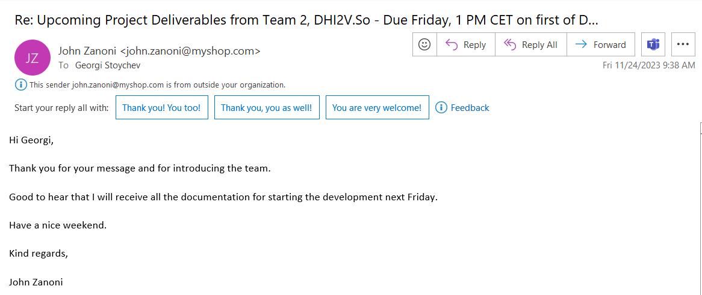

#### Georgi Stoychev to Mr. Zanoni
- **Date:** [01/12/2023]
- **Subject:** Promised deliverables from team 2
- **Summary:** The promised deliverables are sent to Mr.Zanoni within the promised deadline.

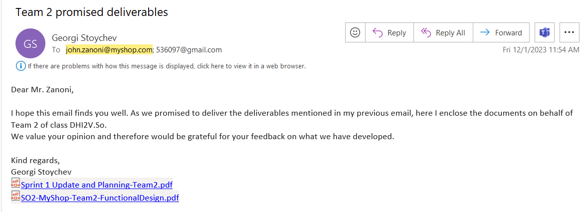

#### Mr. Zanoni to Georgi Stoychev
- **Date:** [01/12/2023]
- **Subject:** Promised deliverables from team 2
- **Summary:** Mr. Zanoni acknowledges that he has received the promised materials and that he would get back to us after he has analyzed them.

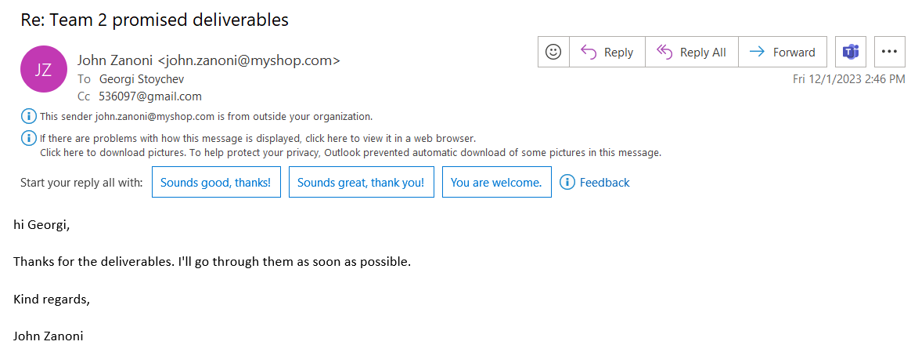

---

### Sprint 1: Development and Iterative Feedback

#### Mr. Zanoni to Georgi Stoychev
- **Date:** [04/12/2023]
- **Subject:** Promised deliverables from team 2
- **Summary:** Feedback on delivered documentation, suggestions for improvements, and additional feature requests.

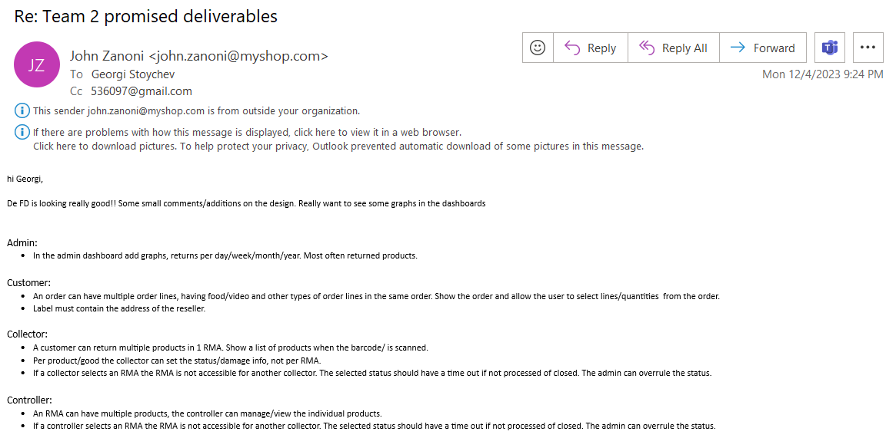

#### Georgi Stoychev to Mr. Zanoni
- **Date:** [04/12/2023]
- **Subject:** Promised deliverables from team 2
- **Summary:** Showing gratitude and appericiation for the quick and insightful feedback provided on our delivered documentation. Highlighting that we will incorporate the feedback and the refactored iteration + the technical/system design will be emailed back to the client.

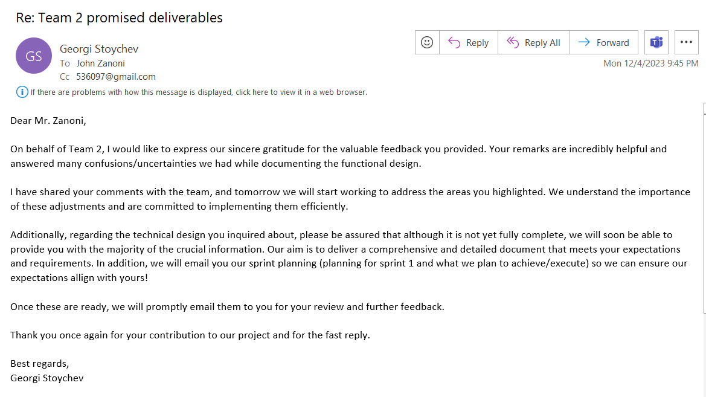

#### Georgi Stoychev to Mr. Zanoni
- **Date:** [06/12/2023]
- **Subject:** Refined version of functional design, technical design and sprint planning documentstion of Team 2, class So Saxion
- **Summary:** Delivering the refactored version of the functional design based on the client's feedback, enclosing the technical designed he inquired about and outlining the sprint 1 goals of our team.

#### Georgi Stoychev to Mr. Zanoni
- **Date:** [14/12/2023]
- **Subject:** Myshop RMA application,Team 2, Saxion ICT
- **Summary:** Keeping the client informed when he can expect to see the goals for sprint 2.

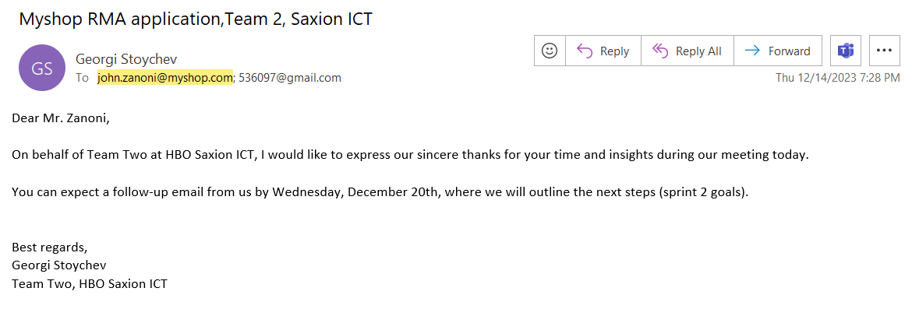

#### Georgi Stoychev to Mr. Zanoni
- **Date:** [19/12/2023]
- **Subject:** Myshop RMA application,Team 2, Saxion ICT
- **Summary:** Providing a document to the client with our goals for sprint 2

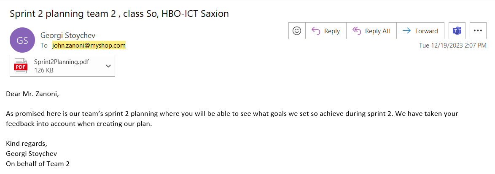

#### Mr. Zanoni to Georgi Stoychev
- **Date:** [19/12/2023]
- **Subject:** Promised deliverables from team 2
- **Summary:** The client acknowledges that he has received the sprint planning and goals of our team for sprint 2.

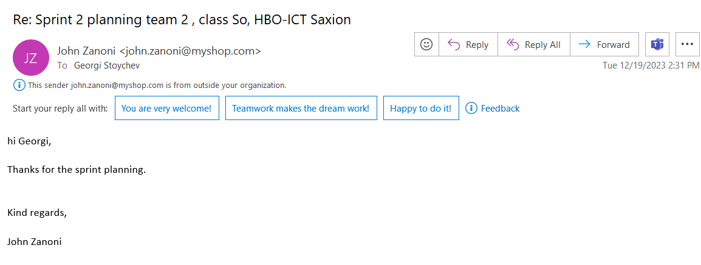

---

### Sprint 2: Pre final stage of development

#### Georgi Stoychev to Mr. Zanoni
- **Date:** [10/01/2024]
- **Subject:** Saxion HBO-ICT team 2, live demo on Thursday
- **Summary:** Reminding the client about our upcoming live demo in sprint 2 and outlining what features he can expect to see during the demo

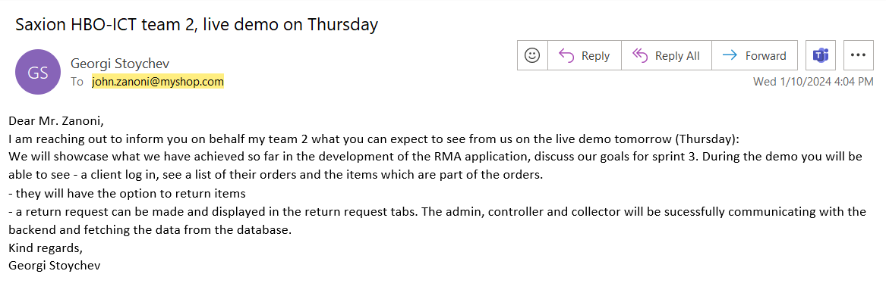

#### Mr. Zanoni to Georgi Stoychev
- **Date:** [11/01/2024]
- **Subject:** Re: Saxion HBO-ICT team 2, live demo on Thursday
- **Summary:** Client asks if the venue will remain the same as we have had it before and if the demo will be at 12:30

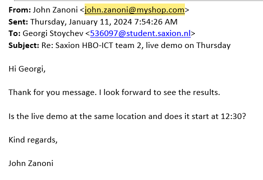

#### Georgi Stoychev to Mr. Zanoni
- **Date:** [11/01/2024]
- **Subject:** Saxion HBO-ICT team 2, live demo on Thursday
- **Summary:** Responding to the client that the venue and time remain unchanged.

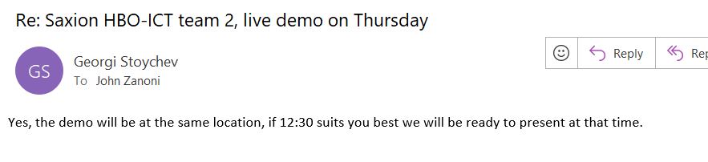

---

### Sprint 3: Final sprint

#### Georgi Stoychev to Mr. Zanoni
- **Date:** [16/01/2024]
- **Subject:** Online meeting request, Saxion Team 2, Myshop RMA prototype
- **Summary:** Requesting to have 2 meetings with the client for more feedback ( one in the middle of the sprint and one as the final demo)

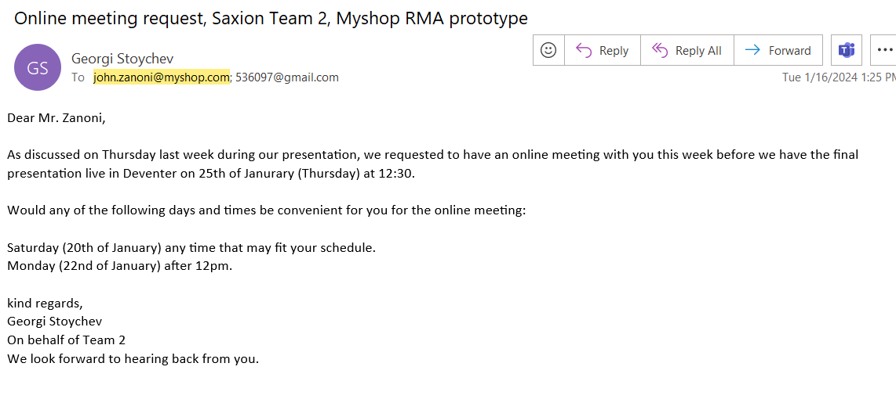

#### Mr. Zanoni to Georgi Stoychev
- **Date:** [17/01/2024]
- **Subject:** Re: Online meeting request, Saxion Team 2, Myshop RMA prototype
- **Summary:** Client chooses the option to have the meeting online on monday and requests to be emailed a Google Meets link.

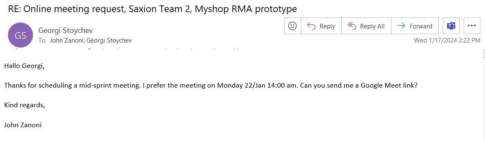

#### Georgi Stoychev to Mr. Zanoni
- **Date:** [17/01/2024]
- **Subject:** Online meeting request, Saxion Team 2, Myshop RMA prototype
- **Summary:** Emailing the client a link fot the Google Meets meeting

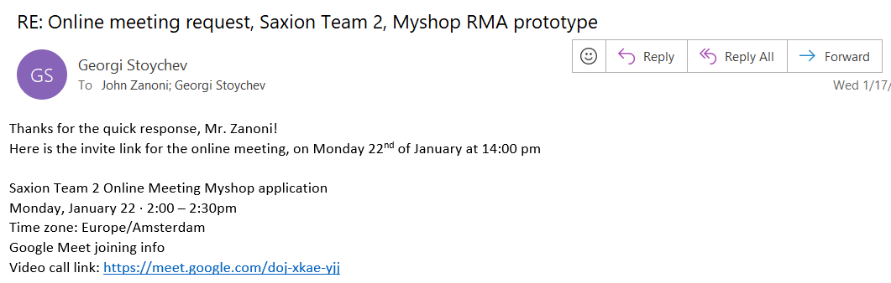

#### Georgi Stoychev to Mr. Zanoni
- **Date:** [24/01/2024]
- **Subject:** Final presentation- Team 2 - MyShop prototype expectations for tomorrow (25th of January)
- **Summary:** Setting the expectations for the final demo and outlining in details what features the clint can expect to see during the presentation.

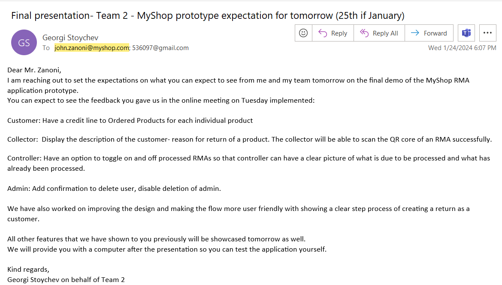

---

### Client Evaluation and Feedback

#### Mr. Zanoni to Georgi Stoychev
- **Date:** [26/01/2024]
- **Subject:** Expressing gratitude for the developed product by Team 2
- **Summary:** The client expresses his appreciation towards the team and the developed product and highlights what the project we have built will be used for in terms of improving the internal structure of Msyhop.

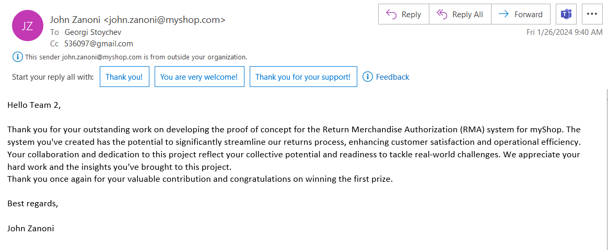

#### Feedback from Mr. Zanoni
- **Date of Survey Completion:** [26/01/2024]
- **Overall Satisfaction:** [Rating 3/3 stars]
- **Comments:** Brief comments on communication effectiveness, responsiveness, and overall satisfaction with the process.

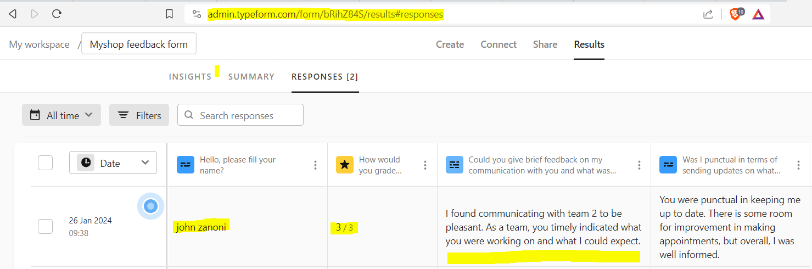