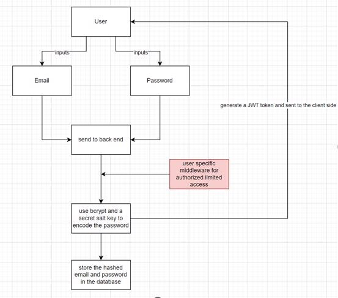
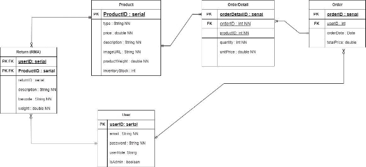



System Design 

Client & Project Owner: John Zanoni, john.zanoni@myshop.com 

||||
| :- | :- | :- |
|Team 2 |3/12/23 |Project Client On Board |
||||
Contents 

[1-  Introduction .................................................................................................................................... 2 ](#_page2_x69.00_y72.92)[2-  General overview and approach ..................................................................................................... 2 ](#_page2_x69.00_y328.92)

[3-  Design considerations ..................................................................................................................... 2 ](#_page2_x69.00_y375.92)

1. [Overview ..................................................................................................................................... 2 ](#_page2_x69.00_y400.92)
1. [System Architecture .................................................................................................................... 2 ](#_page2_x69.00_y484.92)
1. [User Roles and Access Control .................................................................................................... 2 ](#_page2_x69.00_y566.92)
4. [Testing Environment.................................................................................................................... 2 ](#_page2_x69.00_y662.92)
4. [Product Categorization and Constraints ..................................................................................... 3 ](#_page3_x69.00_y72.92)
4. [RMA Process Workflow ............................................................................................................... 3 ](#_page3_x69.00_y153.92)
4. [Data Management and Security ................................................................................................. 3 ](#_page3_x69.00_y250.92)
4. [Refund and Stock Management .................................................................................................. 3 ](#_page3_x69.00_y331.92)
4. [Admin Supervision and Audits .................................................................................................... 3 ](#_page3_x69.00_y413.92)
4. [Mobile and Responsive Design ................................................................................................. 3 ](#_page3_x69.00_y495.92)
4. [Deployment Strategy ................................................................................................................ 3 ](#_page3_x69.00_y591.92)
4. [Client Feedback and Iterations.................................................................................................. 3 ](#_page3_x69.00_y658.92)
4. [Constraints and Limitations....................................................................................................... 3 ](#_page3_x69.00_y726.92)

[4-  System Architecture ........................................................................................................................ 4 ](#_page4_x69.00_y109.92)[1-  Logical view (functional components) ....................................................................................... 4 ](#_page4_x69.00_y134.92)[2-  Hardware architecture (deploy) ................................................................................................. 4 ](#_page4_x69.00_y175.92)[3-  Software architecture (overview, libs, protocols, frameworks, components, API's, etc) .......... 4 ](#_page4_x69.00_y572.92)[4-  Information architecture (what data is provided how, navigation) ........................................... 7 ](#_page7_x69.00_y221.92)[5-  Security architecture .................................................................................................................. 8 ](#_page8_x69.00_y72.92)[6-  Performance............................................................................................................................... 9 ](#_page9_x69.00_y72.92)[5-  System Design ................................................................................................................................. 9 ](#_page9_x69.00_y93.92)[1-  Database design ......................................................................................................................... 9 ](#_page9_x69.00_y159.92)[2-  User interface design ............................................................................................................... 10 ](#_page10_x69.00_y72.92)[3-  Hardware design ...................................................................................................................... 10 ](#_page10_x69.00_y110.92)[4-  Software Design ....................................................................................................................... 11 ](#_page11_x69.00_y72.92)[5-  Security Design......................................................................................................................... 11 ](#_page11_x69.00_y127.92)[6-  Changelog...................................................................................................................................... 12 ](#_page12_x69.00_y210.92)

1- Introduction 

Here is a quick description of MyShop taken from there website: 

“With myShop.com's SaaS software you can start an online store - in both the consumer market (B2C) and business market (B2B). 

At myShop.com you can design an online store to your own taste. Dozens of templates, colors and layouts are available for this. You can set up your online store in various languages. It is also possible to manage multiple web shops within one account.” 

Project Client on Board is one of the courses we have to do during our second year of Software Engineering, in this course we will be collaborating with the company of MyShop to design a prototype system to make product returns, called RMA. With this system, customers will be able to return items, through a web page application, that allows them to know the conditions that the products must be in and the products they are allowed to return. Then the package will be received by the collector, who will do an inspection and a report, then send to the controller who will decide if the product gets returned or not. Thanks to this prototype the developers and system managers of MyShop will be able to inspire themselves, to improve their current return operations. 

2- General overview and approach 3- Design considerations 

1. Overview 

In  this  chapter,  we  delve  into  the  key  design  elements  that  shape  the  myShop  Return Merchandise Authorization (RMA) application. The intent is to outline the app's structure, elaborate on the system's functionality, and ensure that it caters to user requirements and business objectives effectively. This consideration is the backbone of a robust and scalable application. 

2. System Architecture 

The myShop RMA application will be designed as a web-based solution to provide platform independence and ensure accessibility across various devices. Given the necessity for collectors to access the system on the go, special emphasis is placed on responsive design, ensuring functionality on both desktop and mobile platforms. 

3. User Roles and Access Control 

The  application  defines  four  primary  user  roles:  Administrator,  Collector,  Controller,  and Customer. Each role is associated with specific permissions to interact with the system, aligning with the principle of least privilege. For example, Collectors can update the status of RMAs but cannot initiate refunds, a task reserved for Controllers. A secure admin panel, intended to offer detailed control over user actions, is used to handle role assignments and permissions. 

4. Testing Environment 

To facilitate thorough testing, a mock-up environment mirroring the production system will be established. This environment will include a diverse set of test orders featuring various product types, prices, and special conditions such as excessively heavy products. Filters will be implemented to  allow  testers  to  simulate  different  scenarios,  such  as  returns  within  the  legal  period  or  the handling of non-food items. This testing ground is crucial for uncovering any potential issues before deployment. 

5. Product Categorization and Constraints 

The system will incorporate logic to categorize products as either food or non-food and apply specific constraints for returns. Special conditions, such as the requirement for video games to be returned sealed, are also considered. This categorization plays a crucial role in the RMA process, ensuring that returns are processed in line with the company's policies. 

6. RMA Process Workflow 

The  RMA  creation  workflow  includes  a  customer-initiated  process  that  allows  for adding comments to the RMA and downloading a return label. The system supports tracking the RMA's status and enables cancellation under specific conditions, such as before the label is printed. The workflow is designed to be intuitive and user-friendly, guiding customers through each step to ensure clarity and efficiency. 

7. Data Management and Security 

Given the prototype nature of the project, customer data storage will be limited to essential information such as usernames and email addresses. The system's design will incorporate robust security measures, including data encryption, to ensure compliance with data protection standards, notably GDPR. 

8. Refund and Stock Management 

The application will manage refunds and stock adjustments following the return of products. The system will include an automated stock management feature that updates inventory levels in real-time  as  products  are  returned  and  processed  by  the  controller.  This  feature  is  crucial  for maintaining accurate stock records. 

9. Admin Supervision and Audits 

An  admin  dashboard  will  be  implemented,  providing  administrators  with  a  complete overview of all RMA activities. This feature allows admins to monitor the return process, view the involvement of specific staff members, and intervene in decisions when necessary. This functionality is essential for maintaining quality control and ensuring accountability within the RMA process. 

10. Mobile and Responsive Design 

Special attention is given to the mobile responsiveness of the application, ensuring that it functions seamlessly on mobile devices. This is particularly important for collectors who may access the system on the go. The design will be tested on various popular devices to guarantee optimal performance and usability. 

Devices to be tested for responsiveness: Apple iPhone, Samsung, Huawei (latest models 2019-2023) 

11. Deployment Strategy 

Initially, the application will be deployed on a local host for internal testing and refinement. Plans are in place for subsequent deployment on a virtual machine once we are provided with access to such an environment by our lecturers, allowing for broader accessibility and real-world testing. 

12. Client Feedback and Iterations 

The development process will incorporate regular feedback sessions with the client. These sessions are intended to review the application's progress, make necessary adjustments, and ensure that the final product aligns with the client's expectations and needs. 

13. Constraints and Limitations 

The  design  acknowledges  certain  constraints,  such  as  the  non-returnability  of  specific products and the limitation of prototype features like RMA cancellations once a label is printed. These  constraints  are  factored  into  the  system's  functionality  to  ensure  realistic  and  practical operation. 

4- System Architecture 

1-  Logical view (functional components) 2-  Hardware architecture (deploy) 

` `A web application is a software program that runs on a web server and can be accessed by users through a web browser, such as Firefox, or Chrome. For our hardware architecture, we have three component user’s computer, server, and database. 

The user’s computer or phone is the device that the user uses to interact with the web application. The user can enter data, request information, or perform actions. The web browser sends and receives data from the server using a communication protocol, such as HTTP. 

The server hosts the web application and manages the user’s requests. The server will run the web application implementation, which will be written in JavaScript. The implementation will process the user’s data, perform different tasks such as login into their account, creating an RMA. The database will store and manage the data. The database will receive queries from the server and return the results.

Local  Server:  Initial  deployment  on  a  local  server  (localhost)  for  internal  testing  and development purposes. 

Virtual  Machine:  Planned  migration  to  a  virtual  machine  for  broader  accessibility  and operational testing, ensuring scalability. 

3-  Software architecture (overview, libs, protocols, frameworks, components, 

API's, etc) 

For this project, we are going to be using the svelte framework for the front end. Why is that and what is svelte?  

Svelte is a modern front-end, open-source JavaScript framework for making interactive web pages. It is like other existing frameworks, for example, Vue, but with other features which give us developers a better experience. One of the main plus features is the low number of lines needed to code, this can reduce room for error and improve the readability of our code. 

Why Use Svelte for Front-End Development? 

Given its efficiency and ease of use, Svelte is well-suited for building responsive and interactive user interfaces for the Administrator, Customer, Collector, and Controller dashboards in our application. The Svelte component system also allows us to reuse code across our dashboards which keeps our code separated. 

The components that we plan to use for our project to help keep our code separated will be the login/creation forms, the different dashboards for all the users, forms for creating RMAs, and the handling of the goods by the collectors and the status page for the tracking of the RMAs on the customer side. 

For our backend, we are going to be using Node.js with Express.js 

Node.js is a powerful platform for building a variety of applications. It will allow us to easily add, delete and modify data in our database while also collecting data from our forms on the front end. It is known for its efficiency and scalability, making it a popular choice for modern web application development, especially for applications that require a persistent connection from the browser to the server as our one will have to, to stay working. 

We plan to have different APIs and endpoints for keeping our code separated and so that no pages are too long, we will have an endpoint for user management including creating, managing, and assigning roles. An endpoint for RMA creation and tracking and an Endpoint for the handling of goods including the scanning, status updates and damage reporting. 

JWT or JSON Web Tokens will be used also in our backend to provide user authentication and authorisation to the system to make it secure and ensure that users are only ever supposed to do what the system allows them to do. 

For our database, we are going to be using NoSQL. 

NoSQL stands for ‘not only SQL,’ but these databases are also designed to handle large amounts of data and traffic, this is because the way that NoSQL stores its data differs from most other database management systems. For example, if you were to store the details of a user and their hobbies, in a relational database, you would likely need two different tables for this which connect to the ID of the user, but in NoSQL you can use a document database to store the information about the user AND their many hobbies in the same place, meaning you don’t need to join any tables to retrieve information. Overall, for this project, NoSQL will make it a lot more efficient for us to store data. 

For storing images in our application, we will be using Amazon S3 and to send mail, we will be using Mailgun. 

Amazon Simple Storage Service (S3) is a scalable object storage service. It allows us to store and retrieve any amount of data from anywhere on the web. In our project, this means that we can store the images of damaged goods sent by our collectors and retrieve them again for the controller or the Administrator to see. 

Mailgun is an email automation service. It provides a powerful set of APIs to send, receive, and track emails. In our project, Mailgun can be used to send email notifications to customers about their RMA status if anything appears to be damaged or if a problem has occurred. 

4- Information architecture (what data is provided how, navigation) 

Data Flow: 

- Administrator: Manages user accounts and roles, and views RMA processing details.
- Customer: Places orders, creates RMAs, tracks RMA status, and cancels 

RMAs.

- Collector: Handles goods on delivery, checks status, and updates RMA status.
- Controller: Processes RMAs, refunds, and stock management. 

Navigation:

- Easy navigation between user-specific dashboards.
- Clear paths for RMA creation, tracking, and management.
- Efficient access to administrative functions and user account management. 

5-  Security architecture

The user logs into the system with his email and password. The information of his inputs will then be sent to the backend and encrypted using bcrypt and salt key to encode the password. The bcrypt is a password hashing function to build cryptographic hash of the user inputs. It will be transformed into another string of characters, which is stored in the database. Hashed versions are difficult to reverse, which means if someone gains access to it, they cannot easily determine the original password. The secret salt key ensures that different users can have the same password because a random piece of data will be added to each password before it is hashed. The combination of bcrypt and a unique salt for each password provides a robust way to secure user passwords. On the server side there is user specific middleware (isAdmin, isLoggedIn, isController, isCollector, isCustomer) that validates that only the authorized users have permission to perform user specific actions. A JWT token is generated and sent to the front end to authorize the user. The jwt token in stored in a TokenStore.js on the client side of the application so it can be used to determine the role and permitted activities of a logged in user. 

6- Performance 

5-  System Design 1-  Database design

The database schema for the myShop RMA application outlines a comprehensive network of associations among users, products, orders, and return processes. The User table holds account details and roles, indicating if a user is an admin. Products are covered in the Product table with attributes such as price and stock levels. The Order table captures each order's overall information, while the many-to-many relationship between products and orders is managed through the Order Detail junction table, allowing for multiple products to be associated with a single order and vice versa. Returns are tracked in the Return (RMA) table, which maintains a one-to-many relationship with both User and Product, documenting each return instance with user and product IDs. 

2-  User interface design 3-  Hardware design

4-  Software Design 5-  Security Design

Our system implements a secure and efficient user authentication and authorization process. When a user attempts to log in with their email and password, these credentials are sent to the backend. Here, we employ bcrypt, a robust password hashing function, in conjunction with a unique salt key for each user. This approach ensures that even if two users have identical passwords, their hash values will be unique due to the addition of a random data place (salt) before hashing. Consequently, the hashed password, which is a transformed string of characters, is stored in our database. This method is highly secure as hashed versions are inherently difficult to reverse-engineer, ensuring that the original passwords remain confidential even if someone gains access to the database. 

Besides that, our server-side infrastructure includes specialized middleware functions such as ‘isAdmin’, ‘isLoggedIn’, ‘isController’, ‘isCollector’, and ‘isCustomer’. These play a crucial role in verifying that only authorized users can perform actions specific to their roles. Once a user is authenticated, our system generates a JWT (JSON Web Token), which is then sent to the frontend. This token is mandatory for maintaining secure communication and authorizing subsequent user actions.  

On the client side, this JWT token is stored in ‘TokenStore.js.’ enabling our application to consistently verify the user’s role and the activities they are permitted to engage in. This comprehensive system, combining bcrypt with a unique salt for each password and the use of JWT tokens, ensures a secure framework for user authentication and authorization within our application. 

6- Changelog 
