# Functional Design Document

## Client & Project Owner: John Zanoni, john.zanoni@myshop.com
### Team 2 So2

# Table of Contents

[Changelog](#Toc153742604)

[1.0 Introduction](#_Toc153742605)

[2.0 Stakeholders:](#_Toc153742606)

[3.0 Problem Overview:](#_Toc153742607)

[4.0 Context analysis:](#_Toc153742608)

[5. Solution Overview:](#_Toc153742617)

[6. Functional Design](#6-functional-design)

[6.1 Requirements](#_Toc153742619)

[6.2- System requirements:](#62--system-requirements)

[6.2 Use case diagram:](#62-use-case-diagram)

[6.3 User Stories:](#63-user-stories)

[6.4- Flow diagram:](#_Toc153742642)

[6.5- Navigation diagram:](#_Toc153742643)

[6.6- Wireframes:](#_Toc153742644)

[7.0 Plan of approach:](#plan-of-approach)

[8.0 Appendices:](#appendices)

[Appendix A: Return requirement:](#_Toc153742658)

[Appendix B: Notes:](#appendix-b-notes)

[Appendix C: Change Log](#_Toc153742660)

# Changelog

| Version | Date       | Location          | Description                                                  | Author         |
|---------|------------|-------------------|--------------------------------------------------------------|----------------|
| 1.0     | 01-12-2023 | -                 | Initial Document Created – Pending Review                    | Entire Group 2 |
| 1.1     | 05-12-2023 | Requirements      | Updated based on clients feedback                            | Georgi/Badr    |
| 2.0     | 16-12-2023 | Wireframes        | Updated based on Lecturers feedback                          | Badr           |
| 3.0     | 27-01-2024 | Table of Contents | Reduce the content of the table of content base on feed back | Pablo          |
|         |            |                   |                                                              |                |

## *See Appendix C for a full list of changes

# 1.0 Introduction

Here is a quick description of MyShop taken from their website:

“With myShop.com’s SaaS software, you can start an online store - in both the consumer market (B2C) and business market (B2B).

At myShop.com you can design an online store to your taste. Dozens of templates, colours and layouts are available for this. You can set up your online store in various languages. It is also possible to manage multiple web shops within one account.”

Project Client on Board is one of the courses we must do during our second year of Software Engineering, in this course, we will be collaborating with the company MyShop to design a prototype system to make product returns, called RMA. With this system, customers will be able to return items, through a web page application, that allows them to know the conditions that the products must be in and the products they are allowed to return. Then the package will be received by the collector, who will do an inspection and a report, then send it to the controller who will decide if the product gets returned or not. Thanks to this prototype the developers and system managers of MyShop will be able to inspire themselves, to improve their current return operations.

We aim to deliver a product that not only meets the technical requirements but also provides a valuable learning experience for our team and their individual set of learning objectives they wish they achieve in this course.

# 2.0 Stakeholders:

**2.1 Team Overview**:

We are a dynamic group of seven international students from Saxion University in Deventer, specializing in software engineering. As part of our academic curriculum, we have embarked on a project that involves collaborating with a client and applying our theoretical knowledge to a practical, real-world scenario.

**2.2 Team Composition and Roles**:

Our team are diverse in skills and backgrounds, and we have assigned specific roles to each member to streamline our workflow and ensure effective project management. The roles within our team include:

**2.3 Scrum Master (Rotational)**:

Sprint Zero Scrum Master: Pablo

The role of the Scrum Master will rotate among team members at the end of each sprint to promote learning and adaptability.

**2.4 Note Taker (Rotational)**:

Sprint Zero Note Taker: Brice

Similar to the Scrum Master, the role of the note-taker will also rotate with each sprint.

**2.5 Client Contact**:

Primary Contact: Georgi Stoychev (Email: 536097@student.saxion.nl)

Georgi will be responsible for maintaining clear and consistent communication with our client.

**2.7 Stakeholders:**

Our project involves key stakeholders who play a crucial role in guiding and shaping the outcome of our work. These stakeholders include:

**Client (Project Owner)**:

Name: John Zanoni

Email: john.zanoni@myshop.com

As the project owner and our client, John Zanoni will provide us with project requirements, feedback, and approval throughout the development process.

**Academic Supervisor**:

Name: Eelco Jannink

Email: e.h.a.jannink@saxion.nl

Our teacher, Eelco Jannink, will oversee the academic aspects of the project, ensuring that our work aligns with the course objectives and educational standards.

**2.6 Developers**
Desmond, Badr, Marcelo, Frankie, Georgi, Pablo, Brice.

Our developers are tasked with the technical aspects of the project, including coding, testing, and implementation.

# 3.0 Problem Overview:

The myShop RMA application aims to address several challenges and requirements related to the return of products purchased from a webshop. The main problems and challenges faced in this context are:

The need to create and manage user accounts for administrators, collectors, and controllers can be a time-consuming task, as assigning roles and ensuring proper access is crucial to this application.

Allowing customers to return products while ensuring a user-friendly experience is needed. Handling RMA requests, tracking their status, and generating return labels must be fast and easy for the user.

Ensuring that RMA requests align with the company's return policies, including a 14-day return period, and non-food products etc, requires strict validation and enforcement.

Effectively managing returned products, marking them as damaged or available, and updating inventory is important for maintaining accurate stock levels.

The application needs to be responsive and user-friendly on mobile devices, especially for collectors who may use mobile devices while handling returns.

# 4.0 Context analysis:

## 4.1 Scope of the Project

The primary goal of the project is to develop a Return Merchandise Authorization (RMA) application for MyShop.com. This application is designed to streamline the product return process, making it more efficient and user-friendly for both MyShop staff and their clients.

## 4.2 Final Product Delivery

RMA Application: A comprehensive web-based application that facilitates the entire return process, from initiation by the customer to processing by administrators, collectors, and controllers.

## 4.3 Key Features:

User Management: Allows administrators to create and maintain accounts for various roles.

Customer Portal: This enables customers to file RMA requests, track them, and manage returns within a specified period.

Collector Dashboard: Designed for collectors to manage returned products, including scanning, status updates, and documenting damage.

Controller Dashboard: For controllers to oversee and process RMAs, update inventory, and communicate with customers regarding the return status.

## 4.4 Context within the Company’s Ecosystem

Integration with Existing Systems: The RMA application will not be integrated into myshop.com's existing web platform, but it may serve as a prototype that their developers may use for inspiration and a distinct perspective of how they can potentially improve their current system.

## 4.5 Target Audience

Primary Users: myshop.com’s staff, including administrators, collectors, and controllers, will use the application for managing returns.

Secondary Users: Customers of myshop.com who will use the application to return purchased products.

## 4.6 Business Impact

Customer Satisfaction: By making the return process transparent and efficient, the application will enhance customer satisfaction and loyalty.

Operational Efficiency: Streamlining the return process reduces manual labour and potential errors.

Inventory Management: Improved handling of returned goods will lead to better inventory management and control.

## 4.7 Technological Context

Responsive Design: Ensuring the application is mobile-friendly, particularly for collectors who might use mobile devices.

## 4.8 Compliance with law

The application will enforce return policies, including time limits of 14 days and product eligibility (items in the food category or unsealed video games will not be allowed to be returned).

The system will comply with data protection laws like GDPR.

# 5.0 Solution Overview:

To address the problems outlined above, the myShop RMA application proposes the following solutions:

Implement a user management system with role-based access control. Administrators can efficiently create and manage accounts for collectors and controllers, ensuring proper permissions and access rights.

Design a user-friendly customer portal where customers can easily initiate RMAs (Return Merchandise Authorization), add comments, and download return labels. Provide real-time tracking and cancellation options for RMAs.

Implement strict validation rules to ensure that customers can only create RMAs within the 14-day return period for non-food goods. Provide clear notifications when RMA requests fall outside these constraints.

Create a collector dashboard accessible via a secure username and password for handling incoming returns. Enable barcode scanning to identify expected goods and streamline the unpacking and status-checking process. Allow collectors to document damaged goods with images and descriptions.

Develop a controller dashboard for processing RMAs with a "returned" status. Controllers can efficiently decide whether to refund or notify the customer of damage, update RMA status, and manage inventory.

Ensure that the application is responsive and optimized for mobile use, especially for collectors who rely on mobile devices for their tasks.

By implementing these solutions, the myShop RMA application aims to provide an efficient and user-friendly platform for managing product returns, adhering to company policies, and minimizing manual interventions, therefore enhancing the overall customer experience and speed of the application.

# 6.0 Functional Design

## 6.1 Requirements

### 6.1.1 Business Requirements

| ID   | Requirements                                                                                                                                                                                                 | MoSCoW | Source                   |
|------|--------------------------------------------------------------------------------------------------------------------------------------------------------------------------------------------------------------|--------|--------------------------|
| B1   | The goal of this system is to automatize and smoothen the process of returning items.                                                                                                                        | M      | Client                   |
|  B2  | The business must establish a safeguard policy that protects its users and data stored inside the system by complying with the GDPR.                                                                         |  M     |  Regulation              |
|   B3 | The business must comply with ISO 25010 quality model standards to ensure reliability, efficiency, security, and usability, thereby enhancing the company's reputation and increasing customer satisfaction. |   M    |   Advice                 |
|   B4 | The business must obtain real-time data and insights from the system that enable better decision-making, allowing optimization in the business processes therefore increasing profitability.                 |   M    |   Advice                 |
|  B5  | The business requires insights into the management of returned products, to optimize inventory and reduce risk associated with stock.                                                                        | M      | Advice / myShop Document |

### 6.1.2 - User Requirements:

| ID    | Requirements                                                                                                                                                                                                                | MoSCoW | Source                        |
|-------|-----------------------------------------------------------------------------------------------------------------------------------------------------------------------------------------------------------------------------|--------|-------------------------------|
| U1    | As an administrator, I want to be able to create accounts for all users (customers, collectors, and controllers) so that only authorized users can access the system.                                                       | M      | myShop Document               |
| U2    | As an administrator, I want to be able to assign roles to any user so that I can maintain responsibilities and limit access privileges.                                                                                     | M      | myShop Document               |
| U3    | As an administrator, I want to be able to retrieve an RMA history and the staff who processed it so that I have an overview of the system and establish quality control.                                                    | M      | myShop Document               |
|  U4   | As a customer, I want to create an RMA for a product or group of products that meet the [return requirements](#_Appendix_A:_Return) and are within the legal return period of 14 days.                                      |  M     |  myShop Document              |
|   U5  | As a customer, I want to be able to add a comment to the RMA so that I can specify any details regarding the quality status of the product I am returning or important info that will assist myShop in the decision-making. |   M    |  myShop Document              |
|  U6   | As a customer, I want to be able to download a return label so that I can put it on my return parcel and send it for return.                                                                                                |  M     | myShop Document               |
|  U7   | As a customer, I want to be able to cancel an RMA if no label has been already created/downloaded.                                                                                                                          |  M     |  Client                       |
|  U8   | As a customer, I want to be able to see a list of my placed orders so that I can choose which order to return.                                                                                                              |  S     |  Advice                       |
|  U9   | As a collector, I want to be able to scan the barcode of an RMA package so that I can ensure all the items are present.                                                                                                     |  S     | myShop Document               |
|  U10  | As a collector, I want to be able to update the status report of an RMA so that the RMA can be processed by the controllers.                                                                                                |  S     | myShop Document               |
|   U11 | As a controller, I want to be able to pick an RMA and process each item individually, deciding whether to initiate a refund or notify the customer that they will not be refunded with accurate reasoning.                  |   M    |  myShop Document              |
|  U12  | As a controller, I want to be able to place a product back in stock so that I can maintain the stock capacity.                                                                                                              |  C     | myShop Document               |
|  U13  | As a controller, I want to be able to view the RMA history of a customer so that I can validate the process.                                                                                                                |  C     | myShop Document               |
|  U14  | As a user (customer, controller, collector, administrator) I want to be able to log into the system using my username and password.                                                                                         |  M     | myShop  Document,  Client Q&A |
|  U15  | As a customer, I want to provide reasons for returning items using a guided wizard, enhancing clarity in the return process.                                                                                                |  M     |  Client Q&A                   |
|  U16  | As a collector, I want to be able to add images of damaged goods so that I can have proof of the state of the product.                                                                                                      |  M     | myShop Document               |
|  U17  | As a customer, I should receive email notifications at key stages of the return process.                                                                                                                                    |  S     | Client Q&A,  myShop Document  |
|  U18  | As a user, I want to be able to change my password in case I have forgotten mine.                                                                                                                                           |  M     | Client Q&A,  myShop Document  |
| U19   | As a customer, I want to be able to track the status of my RMA.                                                                                                                                                             | M      | Client                        |
|  U20  | As a controller I want to be able to view the stock of all the products, to ensure that the stock is up to date.                                                                                                            |  M     |  Client Q&A                   |
| U21   | As a controller, I want to see a list of all the current RMAs processed by the collector.                                                                                                                                   | M      | Client Q&A                    |
|  U22  | As a collector, I want to be able to see a list of all the RMAs so that I can start the RMA return process.                                                                                                                 |  M     |  Client Q&A                   |
|  U23  | As a collector, I want to be able to add a description of each product I receive so that the controller can make an informed decision.                                                                                      |  M     |  Client Q&A                   |
| U24   | As an administrator, I want to be able to view a list of all the users.                                                                                                                                                     | M      | Client Q&A                    |
|  U25  | As an administrator, I want to be able to view daily, weekly, monthly, and yearly graphs of several returns and a graph of most returned products.                                                                          |  M     |  Client email feedback        |
| U26   | As an administrator, I want to be able to overrule the status of all the RMAs.                                                                                                                                              | M      | Client email feedback         |
|  U27  | As an administrator, I want to be able to create additional properties/set extra constraints.                                                                                                                               |  M     | Client email feedback         |
|  U28  | As an admin, I want to be able to access and see the list of available products(stock) so that I can create properties/set constraints                                                                                      |  M     | Client email feedback         |

## 6.2- System requirements:

### 6.2.1- Functional Requirements

| ID    | Requirements                                                                                                                                                                                        | MoSCoW | Source                 |
|-------|-----------------------------------------------------------------------------------------------------------------------------------------------------------------------------------------------------|--------|------------------------|
|  F1   | The system allows customers to create an RMA for products that meet the [return policy requirements](#_Appendix_A:_Return).                                                                         |  M     |  U4                    |
| F2    | The system should categorize products and apply constraints such as food/non-food and weight limits for returns.                                                                                    |  S     |  Client Q&A            |
| F3    | The system includes a supervisor mode that allows administrators to monitor RMA activities.                                                                                                         |  C     |  U1, U3                |
|  F4   | For every RMA request, the system will produce a scannable QR code and a distinct reference number that simplifies return tracking and facilitates the handling of items.                           |  M     |  U4, U9                |
| F5    | The app allows customers to provide detailed comments when creating RMAs.                                                                                                                           | M      | U5                     |
| F6    | The system should allow the customers to monitor their RMA progress.                                                                                                                                | M      | U19                    |
|  F7   | The system allows the administrator to create and maintain the accounts for all users (customers, collectors, and controllers).                                                                     |  M     |  U1                    |
|  F8   | The system provides administrators with a comprehensive view of RMA transactions, detailing the involvement of specific collectors and controllers.                                                 |  M     |  U3                    |
|  F9   | The system allows the scanning of the package’sbarcode, enabling controllers to cross-reference actual contents with the anticipated return items.                                                  |  M     |  U9                    |
|  F10  | The system allows for the classification of goods as missing or damaged upon RMA inspection, enhancing inventory accuracy.                                                                          |  M     |  U11, U16              |
|  F11  | The system facilitates collectors in creating visual (images) of damaged goods for reference in the RMA process                                                                                     |  M     |  U16                   |
| F12   | The system allows collectors to update the status of each item/good of an RMA                                                                                                                       | M      | U10                    |
|   F13 | The system enables controllers to finalize RMA outcomes, either processing refunds individually per assessed product/good or communicating non-refundable decisions to customers with explanations. |   M    |   U11                  |
|  F14  | The system allows customers to view and interact with their order history, facilitating informed decision-making for returns.                                                                       |  S     |  U8                    |
|  F15  | The system provides admins to view the RMA history of a given customer, to ensure non-abusive behaviour.                                                                                            |  M     |  U3, U13               |
|  F16  | The system should be able to send emails to the customer at key stages of the return so that the customer is kept informed.                                                                         |  M     |  U17                   |
|  F17  | The system includes a supervisor mode for the admin to step in to adjust or overturn decisions made during the return process.                                                                      |  C     |  U1, U3                |
|  F18  | The system should provide customers with the functionality to download a return label assigned to their package so that they can send the package for return.                                       |  M     |  U6                    |
|  F19  | The system should allow the customer to cancel the RMA if the return label has not been downloaded.                                                                                                 |  M     |  U7                    |
| F20   | The system facilitates collectors in descriptive records (comments) of damaged goods for reference in the RMA process.                                                                              |  M     | U16                    |
|  F21  | The system should provide the controller with templates to send to the customer in key stages of the RMA so that the customer is kept informed.                                                     |  C     |  U17                   |
|  F22  | The system must contain the reseller’s address when generating the return label so that the customer can send it to the correct address.                                                            |  M     |  Client email feedback |
|  F23  | The system must let the collector update the status of each item/good within an RMA so that the RMA is correctly assessed.                                                                          |  M     | Client email feedback  |
|  F24  | The system should not allow any collector to work on an RMA that has been selected by a different collector.                                                                                        |  M     | Client email feedback  |
| F25   | The system should have a timeout for the selected status of an RMA if the collector does not process or close it.                                                                                   | M      | Client email feedback  |
|  F26  | The system should have a timeout for the selected status of an RMA if the controller does not process or close it.                                                                                  |  M     | Client email feedback  |
|  F27  | The system should not allow any controller to work on an RMA that has been selected by a different controller.                                                                                      |  M     | Client email feedback  |
|  F28  | The system should allow the administrator to create additional properties/or set extra constraints.                                                                                                 |  M     | Client email feedback  |

### 6.2.2 - Non-Functional Requirements

| ID    | ISO                     | Requirements                                                                                                                                                          | MoSCoW | Source  |
|-------|-------------------------|-----------------------------------------------------------------------------------------------------------------------------------------------------------------------|--------|---------|
| NF1   | Security                | The system must protect the personal data of customers and employees by terms of encryption of data at rest and in transit.                                           |  M     |  Advice |
| NF2   | Reliability             | The system should have an uptime of 99% to ensure high availability and reliability.                                                                                  | M      | Advice  |
|  NF3  |  Performance Efficiency | The application should load pages and process requests within 3 seconds under normal load conditions to ensure a smooth user experience.                              |  M     | Advice  |
| NF4   | Performance Efficiency  | The system should oversee a minimum of 50 simultaneous user sessions without performance degradation.                                                                 |  M     | Advice  |
| NF5   | Usability               | The system must offer an intuitive and user-friendly interface.                                                                                                       | M      | Advice  |
| NF6   | Security                | The system must comply with the GDPR data protection regulations.                                                                                                     | M      | B2      |
|  NF7  |  Compatibility          | The system must be compatible and optimized to operate in different browsers such as Safari, Google Chrome, Brave, Firefox, and Microsoft Edge.                       |  S     |  Advice |
|  NF8  |  Security               | To guarantee that the system and its information are only accessible by authorized users, it is necessary to incorporate access control with a username and password. |  M     |  Client |
|  NF9  |  Portability            | The system runs on different platforms and devices, such as Windows, Linux, Mac OS, IOS and Android.                                                                  |  S     |  Advice |
|  NF10 |  Portability            | The system is compatible with different screen sizes and resolutions and adapts to different orientations and models.                                                 |  S     |  Advice |
|  NF11 |  Accessibility          | The system provides features such as reader support, contrast ratio, text resizing, and captions for audio and video content.                                         |  S     |  Advice |
|  NF12 |  Maintainability        | The system has proper documentation and testing procedures to facilitate future updates and bug fixes.                                                                |  S     |  Advice |

## 6.2 Use case diagram:

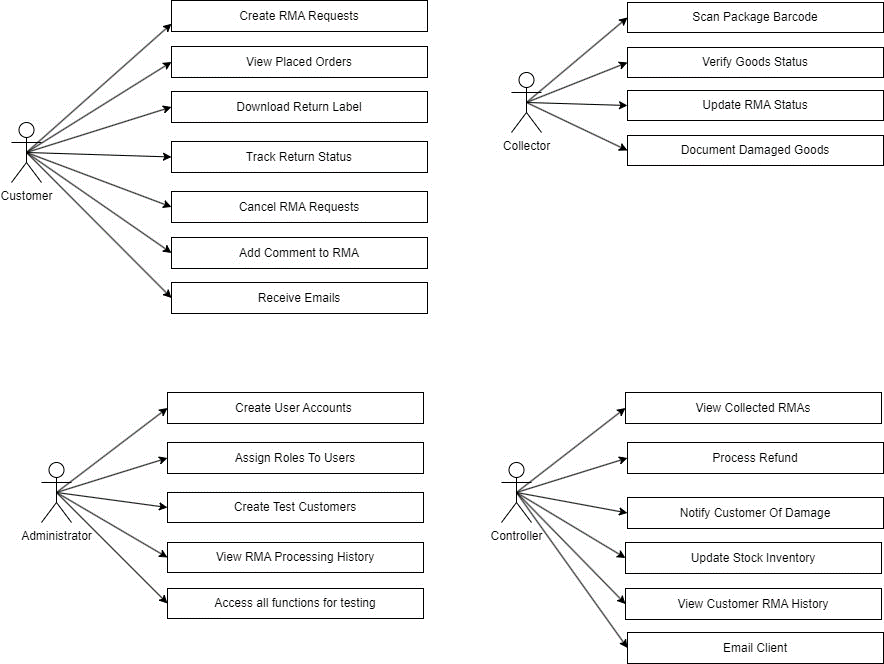

Figure 1: Use case diagram of activities of user’s interactions with the system

## 6.3 User Stories:

### U1: As an administrator, I want to be able to create accounts for all users (collectors, and controllers) so that only authorized users can access the system.

-   Actor: Administrator
-   Precondition: Administrator is logged in to the system
-   Steps:
-   Admin selects “Create Account” and enters necessary details (username, password, role) for the new user.
-   Admin submits the form.
-   The system creates a new account and confirms the creation of the account to the administrator.
-   Postcondition: A new user account is created.
-   Remarks: When testing, the test data should contain distinct roles (customers, controllers, collectors).

### 

### U2: As an administrator, I want to be able to assign roles to any user.

-   Actor: Administrator
-   Precondition: The administrator is logged in to the system.
-   Steps:
-   The administrator selects "Assign Role" and chooses a user.
-   The administrator selects a role from the available options.
-   The Administrator submits the form.
-   Postcondition: The selected user is assigned to a new role.

### U3: As an administrator, I want to be able to retrieve an RMA history and the staff who processed it so that I have an overview of the system and establish quality control.

-   Actor: Administrator
-   Precondition: The administrator is logged in to the system.
-   Steps:
-   Administrator selects “Retrieve RMA History.”
-   System displays a list of RMAs with details of the staff who processed each RMA.
-   The administrator reviews the list of RMAs for quality control purposes.
-   Postcondition: The administrator can view the RMA history and the staff who processed each RMA.
-   Remarks: When testing, the test data should contain at least one processed RMA with associated staff details.

### U4: As a customer, I want to create and track an RMA for a product or group of products that meet the [return requirements](#_Appendix_A:_Return) and are within the legal return period of 14 days.

-   Actor: Customer
-   Precondition: Customer is logged in to the system and has a least one order that meets the [return requirements](#_Appendix_A:_Return).
-   Steps:
-   Customer selects “Create an RMA Request.”
-   Customer selects the order and products for the RMA.
-   Customer clicks on “Submit Request.”
-   The system creates a new RMA and generates a label with customer details and a barcode.
-   Customer selects “Track RMA” and enters the RMA number.
-   The system displays the status of the RMA.
-   Postcondition: A new RMA is created and can be tracked by the customer.
-   Remarks: When testing, the test data should contain at least one order that meets the [return requirements](#_Appendix_A:_Return).

### U5: As a customer, I want to be able to add a comment to the RMA.

-   Actor: Customer
-   Precondition: Customer is logged in to the system and has initiated an RMA request.
-   Steps:
-   Customer enters their comment into the 'Comment' text box.
-   Postcondition: The customer's comment is added to the RMA.

### U6: As a customer, I want to be able to download a return label.

-   Actor: Customer
-   Precondition: Customer is logged in to the system and has initiated an RMA request.
-   Steps:
-   Customer selects "Download Return Label" on the RMA form.
-   The system generates a return label and initiates a download on the user's system.
-   Postcondition: The customer has downloaded a return label.

### U7: As a customer, I want to be able to cancel an RMA if no label has been already created/downloaded.

-   Actor: Customer
-   Precondition: Customer is logged in to the system and has initiated an RMA but has not yet downloaded a return label.
-   Steps:
-   Customer selects "Cancel Request" on the RMA form.
-   The system cancels the RMA and confirms the cancellation to the customer.
-   Postcondition: The RMA is cancelled.

### U8: As a customer, I want to be able to see a list of my placed orders so that I can choose which order to return.

-   Actor: Customer
-   Precondition: Customer is logged in to the system and has at least one placed order.
-   Steps:
-   Customer selects “View Placed Orders.”
-   System displays a list of the customer’s placed orders.
-   Customer reviews the list and selects an order to return.
-   Postcondition: The customer can view their placed orders and select an order to return.
-   Remarks: When testing, the test data should contain at least one placed order.

### U9: As a collector, I want to be able to scan the barcode of an RMA package so that I can ensure all the items are present and manage any discrepancies.

-   Actor: Collector
-   Precondition: Collector is logged into the system and has an RMA package to process.
-   Steps:
-   Collector selects “Scan RMA Package.”
-   Collector scans the barcode of the RMA package.
-   The system verifies the goods in the package against the RMA.
-   If the goods in the package match the RMA, the system confirms the verification to the collector.
-   If there is a discrepancy between the goods in the package and the RMA, the system alerts the collector and prompts them to take appropriate action (e.g., contact the administrator).
-   Postcondition: The goods in the RMA package are verified.
-   Remarks: When testing. The test data should contain at least one RMA package with a barcode.

### 

### U10: As a collector, I want to be able to add images of damaged goods so that I can have proof of the state of the product.

-   Actor: Collector
-   Precondition: Collector is logged into the system and has an RMA package to process.
-   Steps:
-   Collector selects “Scan RMA Package.”
-   Collector scans the barcode of the RMA package.
-   The system verifies the goods in the package against the RMA.
-   The system confirms the verification to the collector.
-   Collector has a details overview of the returned goods.
-   Collector opens the package and processes the verification.
-   If any goods are damaged, the collector adds goods status, images and descriptions stating the goods damaged observed.
-   Collector clicks on “Confirm and Create” to finalise the return process on their end and assign the RMA to a controller.
-   Postcondition: The goods in the RMA package are verified and images of damaged goods are added.

### U11: As a controller, I want to be able to pick an RMA for processing and decide to refund the payment or notify the customer if the product is damaged/missing.

-   Actor: Controller
-   Precondition: Controller is logged in to the system and has received an RMA from the Collector.
-   Steps:
-   Controller selects an RMA request on his dashboard for processing.
-   Controller reviews the RMA details and the goods' status.
-   If the product is in an acceptable condition, the controller clicks on “Select an Action” then on “Refund Customer, Send to Stock” then “Confirm” to process the refund.
-   If the product is damaged or missing, the controller clicks on “Select an Action” then on “Product Damaged, Notify Customer” then “Confirm” to inform the customer of the non-refund of the product with an explanation.
-   Postcondition: The RMA is processed, and the customer is notified of the outcome.
-   Remarks: When testing, the test data should contain at least one RMA with a product that is either in acceptable condition, damaged, missing, or not match.

### U12: As a controller, I want to be able to place a product back in stock.

-   Actor: Controller
-   Precondition: Controller is logged in to the system and has a product to return to stock.
-   Steps:
-   If the goods’ status is approved by the controller, they can then click on “Select an Action,” then on “Refund Customer, Send to Stock,” then “Confirm” to return the product to the stock.
-   The system returns the product to stock and confirms the action to the controller.
-   Postcondition: The product is returned to stock.

### 

### U13: As a controller, I want to be able to view the RMA history of a customer so that I can validate the process.

-   Actor: Controller
-   Precondition: Controller is logged in to the system.
-   Steps:
-   Controller clicks on the customer's name.
-   A pop-up will appear with the customer's information and the RMA history of the selected customer.
-   Postcondition: The pop remains on the screen until it is closed by the controller.

### U14: As a user (customer, controller, collector, administrator) I want to be able to log into the system using my username and password.

-   Actor: User
-   Precondition: The system is running on the computer and the user is not logged in.
-   Steps:
-   The user clicks on the username box and types in their username.
-   The user clicks on the password box and types in their password.
-   The user presses on the login button.
-   The system verifies the entered credentials.
-   If the credentials are correct, the system logs the user in. If not, the system prompts the user to enter valid credentials.
-   Postcondition: The user is logged in to the system.

### U15: As a user, I want to be able to change my password in case I have forgotten mine.

-   Actor: User
-   Precondition: The system is running on the computer; the user is not logged in.
-   Steps:
-   The user clicks on the “Forgotten your password?” link on the login page.
-   The user provides its email.
-   The user receives the email to restore the password.
-   Postcondition: The user's password is updated in the system and the user is notified of the successful password change. The user can now log in with the new password.

## 6.4 Flow diagram:

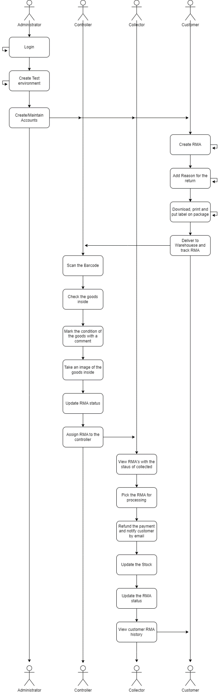

This is the Flow diagram for the RMA system, this shows how the system works from start to finish. Firstly, the administrator starts by creating the test environment as well as the accounts. The customer can then make their RMA and fill in the information about it.

This will then get delivered to the warehouse where the controller can then scan the barcode and check the goods inside. The RMA is now assigned to the collector who will process the RMA while also updating the stock. 

## 6.5 Navigation diagram:

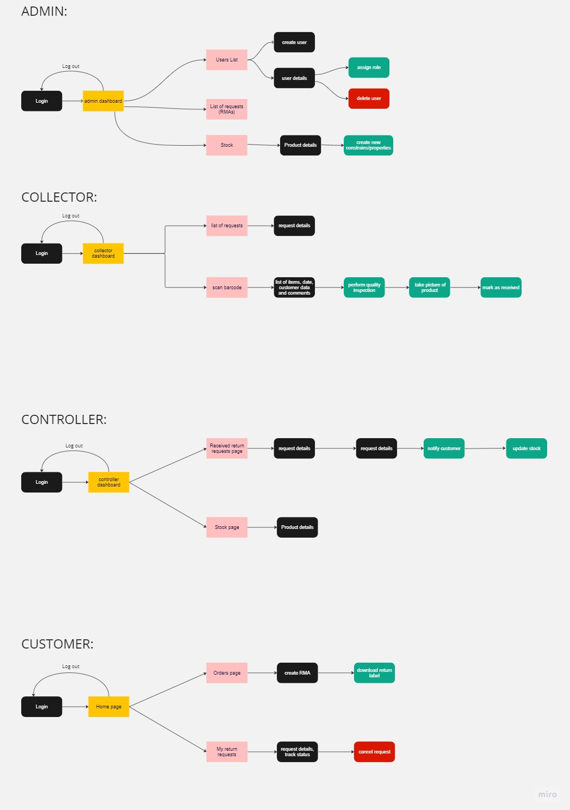

Figure 2: a general overview of system navigation

Please check the figures below for more details and insight

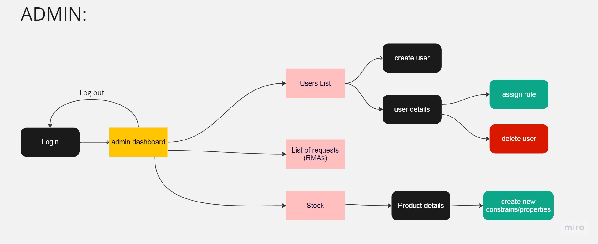

Figure 3: Admin navigation graph

For more details for admin, check [wireframes](#_6.3-_Wireframes: ), 2, 3, 4, 5, and 6, this navigation chart shows how the admin can navigate through the system. He can log in then go to the dashboard, then go either to the list of requests, or the users list then create a user or go to an existing user detail to delete him or assign him a new role. Also, can go to stock, and then he can see product details and change its constraints or properties.

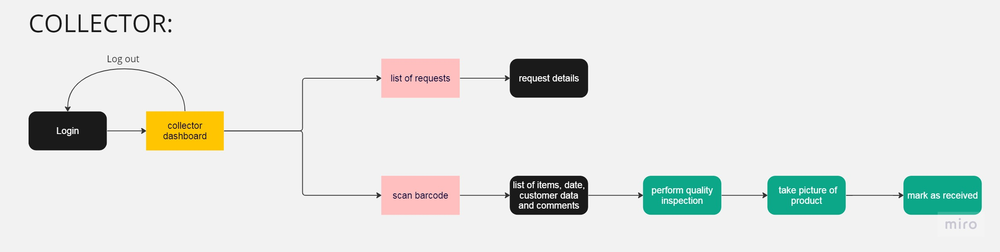

Figure 4: Collector navigation graph

For more details for the collector check [Wireframes 13, 14, 15, 16, 17, 18, 19](#_6.3-_Wireframes: )   
In this navigational diagram, you can see how the controller can surf the system. He first logs in, and then he gets to his dashboard. Then he either goes to the list of requests or selects a request to check its details or he selects the scanned barcode to perform the scanning with a camera then he gets a page with the returned items, customer, and comments, then he performs a quality check, after that, he takes picture of the return items if needed. Later on, he marks the RMA as received.

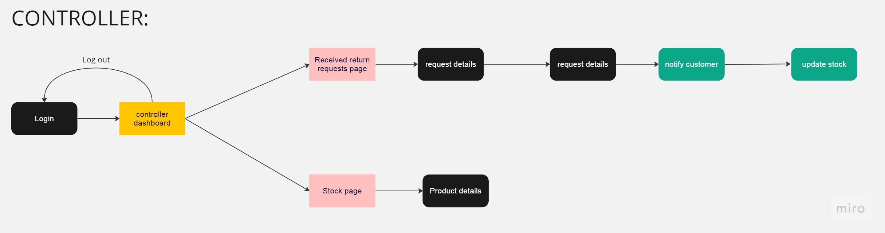

Figure 5: Controller navigation graph

In Figure 4, you can see the navigation diagram that shows how can a controller navigate the system. He first logs in then he gets to the controller dashboard. From the dashboard, he can go either to the stock page and then to product details. Or to receive RMA, then select an RMA to check its details, then to notify the customer if he gets a refund or not and then update the stock For more details on the flow of the controller, check [wireframes 20, 21, 22](#_6.3-_Wireframes: )

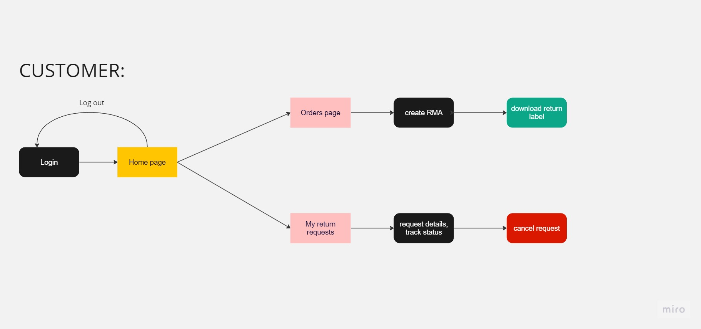

Figure 6: Customer navigation graph

Figure 5 shows the way a customer can navigate through the system. First customer has to log in, then he will be directed to Home page, from the home page a customer can go either to his orders history page, create an RMA from ordered items, then download the label. Or he can go to my return requests page to see the history of his requests, then he can track and see details of an RMA, and also, he can cancel the request. For more details on the flow of customers, check [Wireframe 7, 8, 9, 10, 11, and 12](#_6.6-_Wireframes:).

## 6.6 Wireframes:

### 6.6.1 Login:

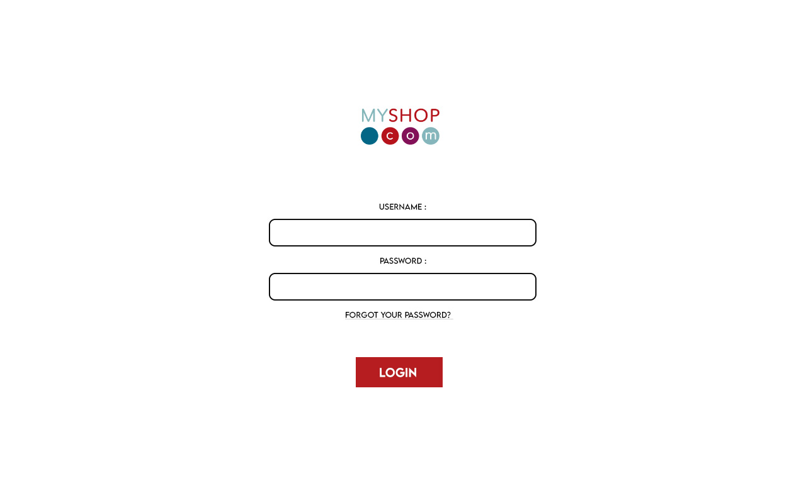

Wireframe 1: Login page

In the wireframe, you see the landing page of the system. This is the login page. It has two required fields: Username and Password, and a login button. And a “forgot your password?” link to reset the password when the user forgot his password. After the user fills in his username and password correctly and presses login it takes him to his dashboard depending on his role. (*U14)*

### 6.6.2 Admin POV:

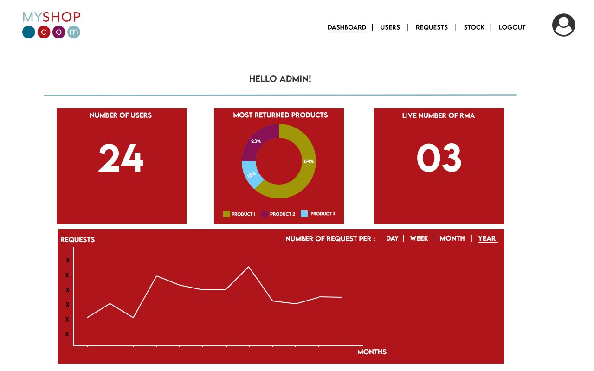

Wireframe 2: Admin Dashboard

In the wireframe 2, you can see the admin’s dashboard. You can access this page after successfully logging in as an admin. The page has a greeting for the admin “Hello admin”. You can also see a header with 5 options. The dashboard has a red line under it because we are currently in the dashboard. Users, to manage the users. And Requests to manage requests. Stock to check the stock and the set of products. And logout in to sign out of the account. You can also see a red box counting the number of users in the system. Another red box has the live total number of RMAs on the system. There is a graph that showcases the most returned products and graphs that display returns per day/week/month/year. There is a line under “YEAR” which means the graph displays the yearly returns, if you wish to see the daily returns, click on “DAY.”

**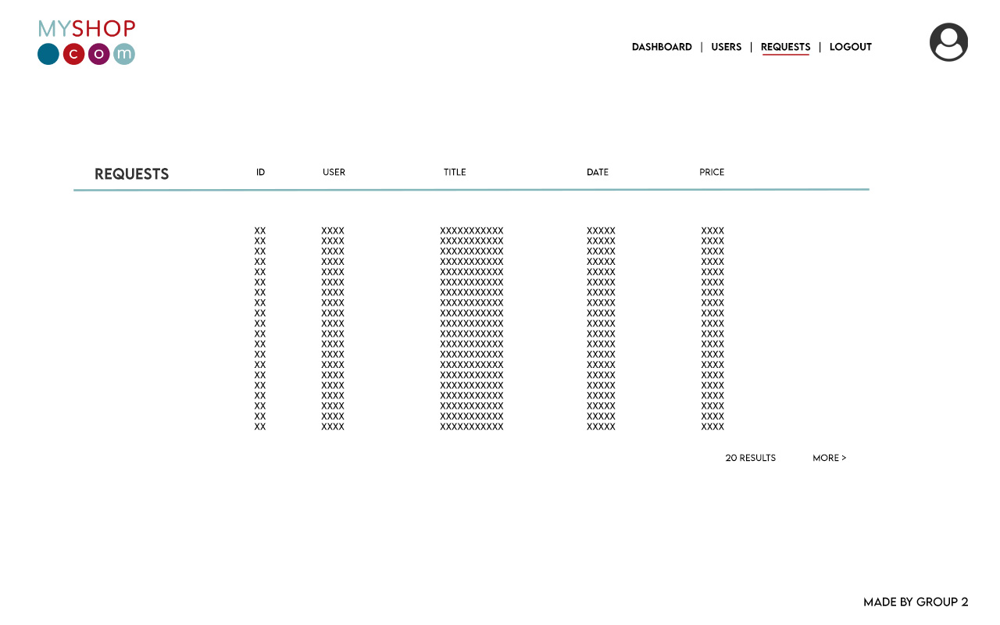**

Wireframe 3: Requests page for Admin

In wireframe 3, you can see the RMA requests page for the admin. You can see the header again. And you can find a list of all the placed requests, and the customer’s name who placed the request. The title of the request, and the date when the request was placed. And the total price of the returned products. The system shows 20 results, and then you can press on more to see more requests. (U3)

**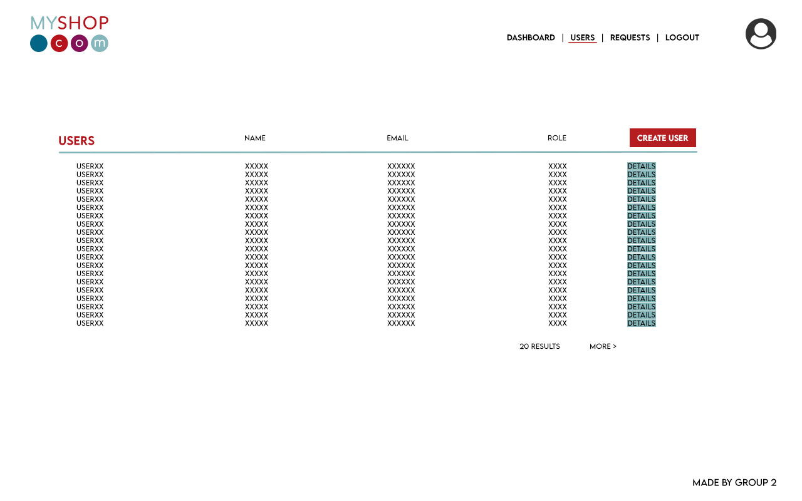**

Wireframe 4: Users page for Admin.

In wireframe 4 you can see the users page for the Admin. As mentioned by you the admin should manage the users. This page has a header also. And a list of users with their username, name, email, and role. There is next to each user a details button to get more details about that specific user. There is also a create user button to create a new user. (U24)

**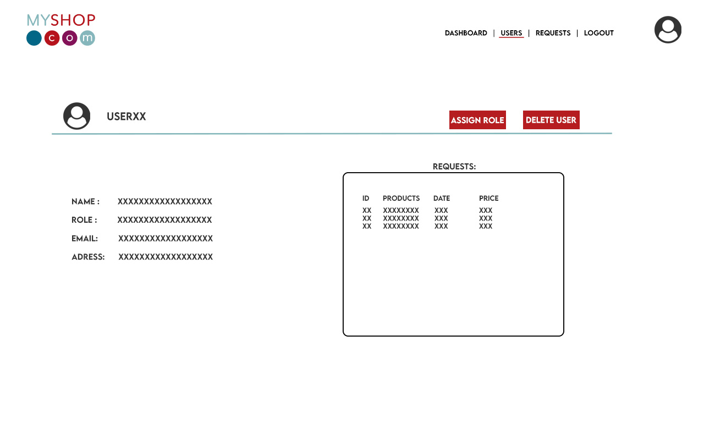**

Wireframe 5: User details page for Admin

For Wireframe 5, you can see the user details page, it is accessible by the admin. The admin can see the details of the user (name + role + email + address). And his history of requests. And two buttons, one for assigning a new role for the user, and another one to delete the account of the user

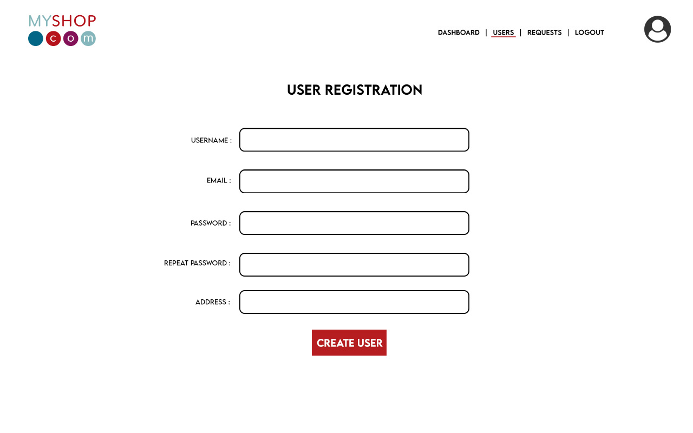

Wireframe 6: Create a user page for Admin.

Wireframe 6 is the user registration page for the admin. The admin can fill in the username, email, password, and repeat the password and the address of the user. Then press the button Create user. All the fields are required. (U1)

**  
**

### 6.6.3 Customer POV:

**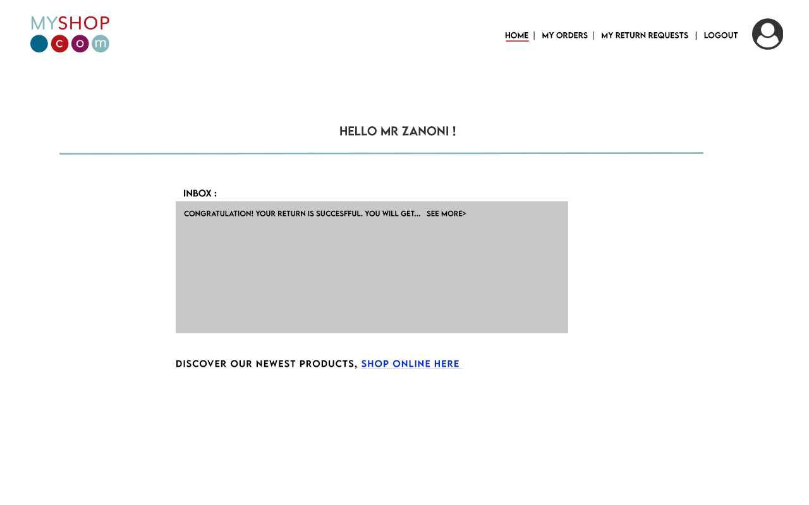**

Wireframe 7: Customer home page

In wireframe 7, you can see the home page of the customer. It shows the header that has some quick links that are home, it has a red line under it because we are currently on the home page. My orders page (wireframe 8) and my return requests page (wireframe 9). It also shows an inbox to have the notifications and updates the customer gets from the store.

**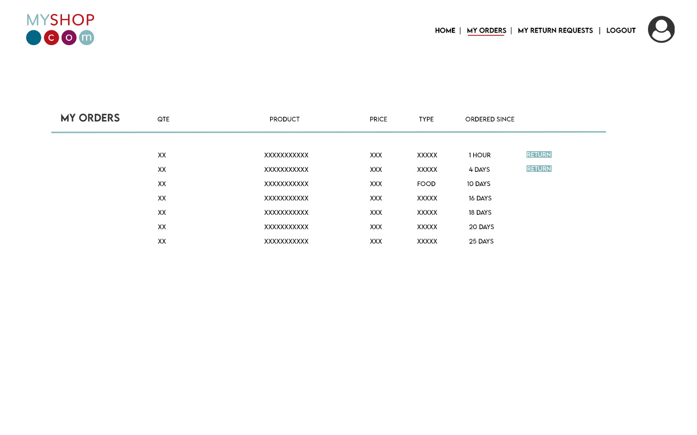**

Wireframe 8: orders page for customers

In wireframe 8, it shows the list of the orders that the customer has, so that he can select what he desires to return. The list shows the details of orders and shows the return button if the product is not food and ordered within 14 days. (U8)

**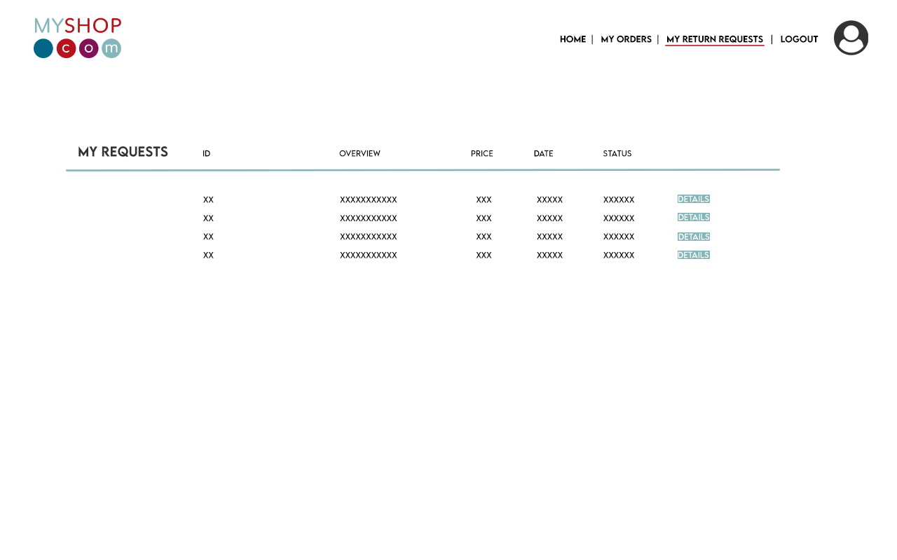**

Wireframe 9: Return requests list page for customer

In Wireframe 9, the customer can see the list of return requests placed by them. Showing the ID and overview of the items and total worth price of the returned items. Also, the date when a request was done and the status. Aldo details button to check details of certain requests. (*U19).*

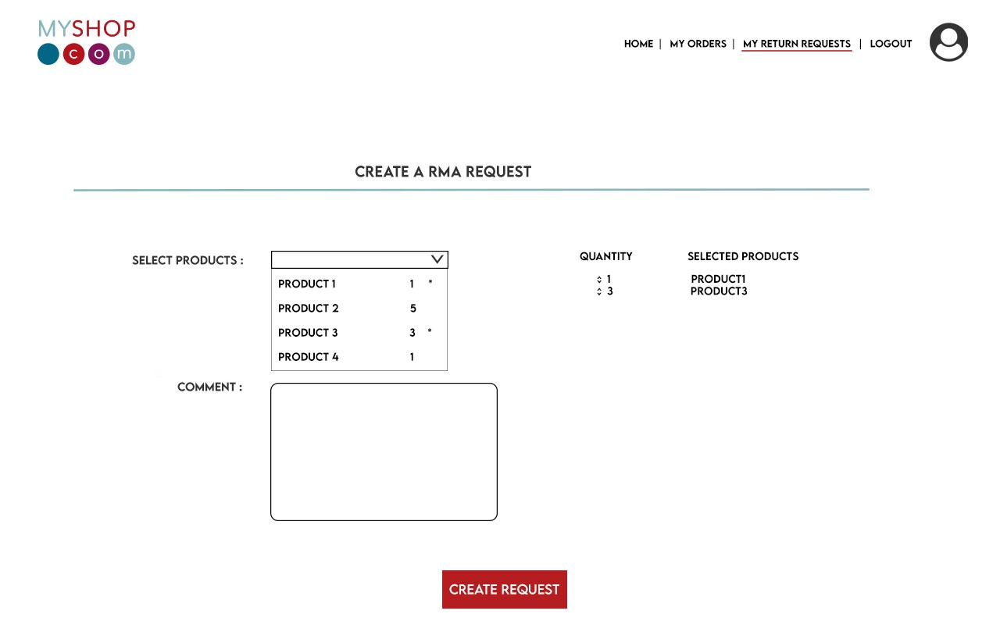

Wireframe 10: creating an RMA page for the customer.

For wireframe 10, you can see the page where customers can create a new request, by selecting the products to return and putting a comment. Then pressing the button creates a request. (U4, U5)

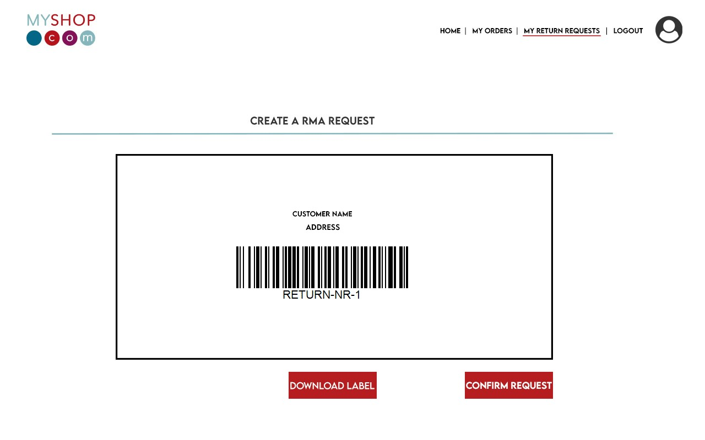

Wireframe 11: Download label page for the customer.

In this wireframe 11, you can see the label page where the customer can download the return label, he gets this page after successfully creating a request. (U4)

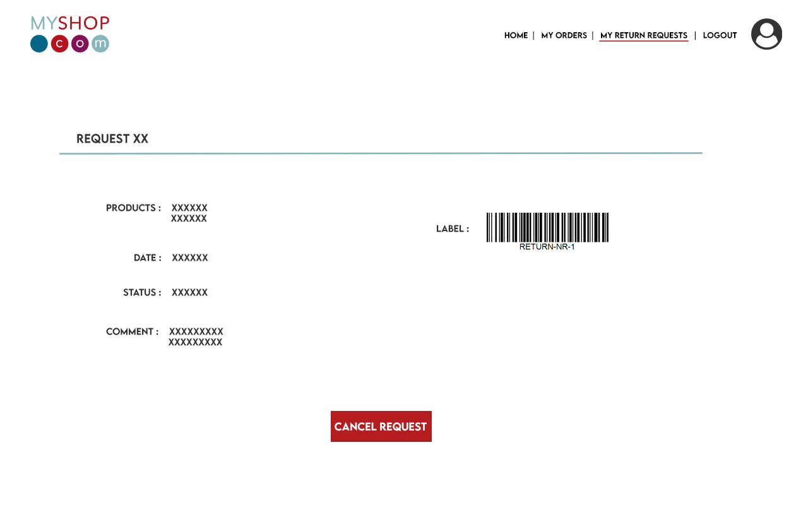

Wireframe 12: Request detail page for customer

In wireframe 12, you can see the page where a customer can check the details of a request that he placed, he can also download the label again by clicking on the barcode. And he can cancel the request if the status shows not received by the company yet. (U7)

**  
**

### 6.6.4 Collector POV:

**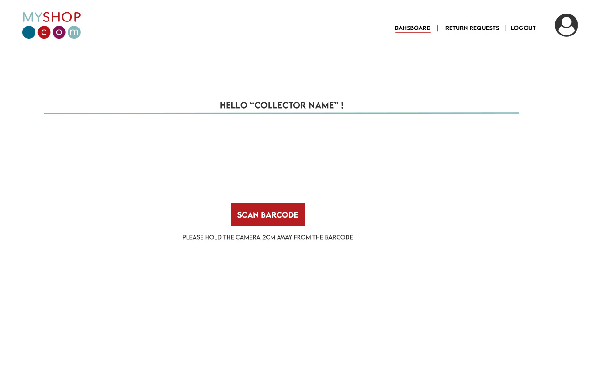**

Wireframe 13: Dashboard of the collector PC overview

For Wireframe 13, you can see the collector’s dashboard. You can access this page after successfully logging in as a collector. The page has a greeting for the collector “Hello (and then their name).” You can also see a header with 3 options. The Dashboard has a red line under it because we are currently in the dashboard. Return Requests which is used to see all the RMA’s. Log out to sign out of the account. You can also see a red button which will open the camera for the collector to scan the barcode.

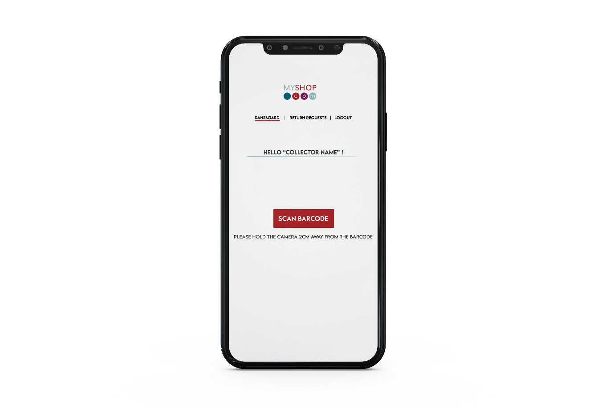

Wireframe 14: Dashboard of the collector mobile overview

In wireframe 14, we can see how the website will look for a collector. This is because collectors will mostly be using their phones, as scanning the barcode while on a computer may be a bit challenging.

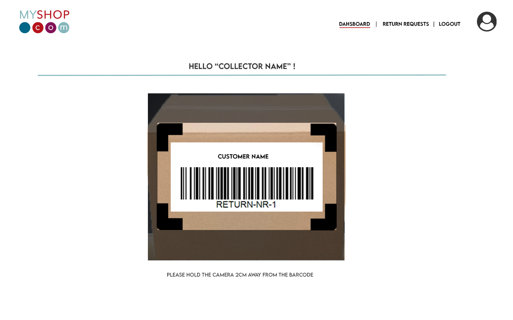

Wireframe 15: Bar-code scanning page for a collector – pc overview

Wireframe 15 shows what happens after the ‘Scan Barcode’ button is pressed. The device's camera is turned on and now the Collector can scan the barcode on the returned goods. (U9)

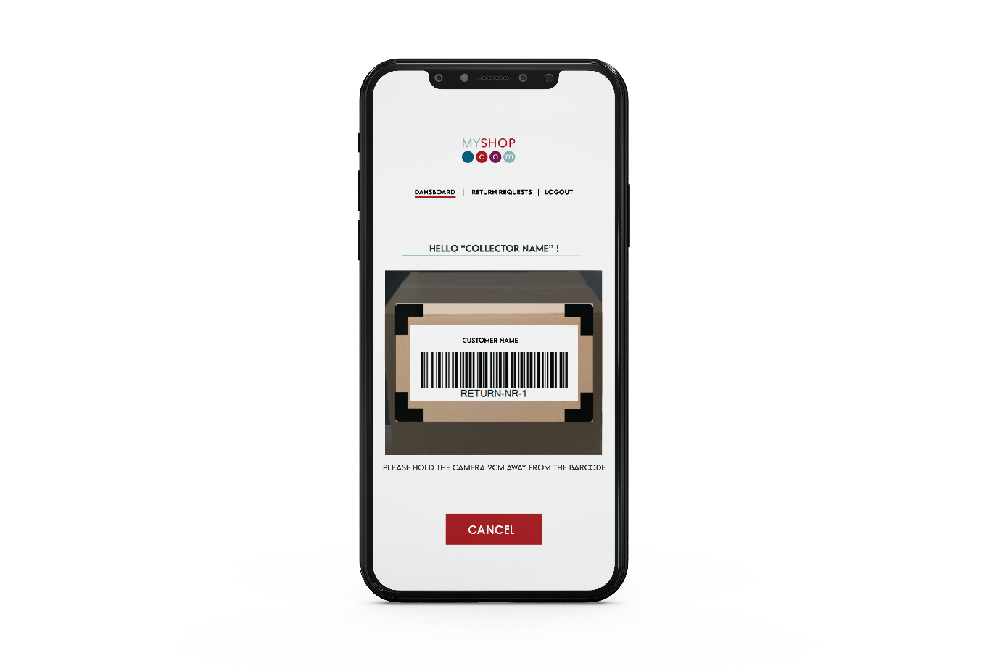

Wireframe 16: bar-code scanning for a collector – mobile overview.

Wireframe 16 shows how the camera will show up on the website for a phone. You are then able to use your phone to scan the barcode. (U9)

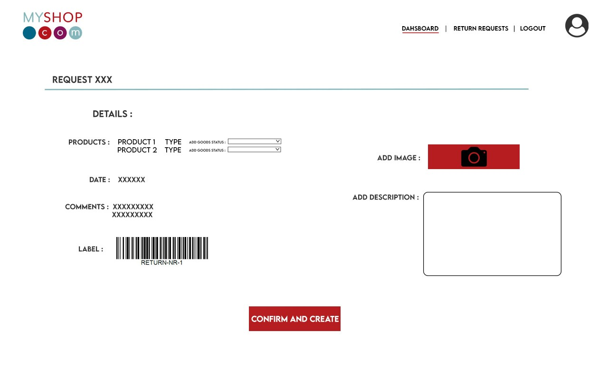

Wireframe 17: request process page for a collector – pc overview

In Wireframe 17, we can see the screen that will pop up after the barcode has been successfully scanned by the collector. This page contains the Information on the products and the customer that returned them. The collector is then asked to select one of the goods statuses as either, good, damaged, or missing. An image can then be attached by the collector with a description of the goods which will contain anything wrong with the returned goods. After the information about the goods has been filled out, the Collector can press the Confirm and Create button to finalise the return process on their end and assign the RMA to a controller. (U16, U10, U23)

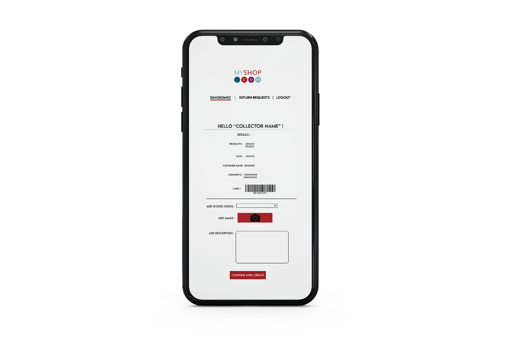

Wireframe 18: request process page for a collector – mobile overview

Wireframe 18 shows the Phone screen for the product information after the barcode has been scanned. The page contains the Information on the products and the customer that returned them. The collector is then asked to select one of the goods statuses as either, good, damaged, or missing. An image can then be attached by the collector with a description of the goods which will contain anything wrong with the returned goods. After the information about the goods has been filled out, the Collector can press the Confirm and Create button to finalise the return process on their end and assign the RMA to a controller. (U16, U10, U23)

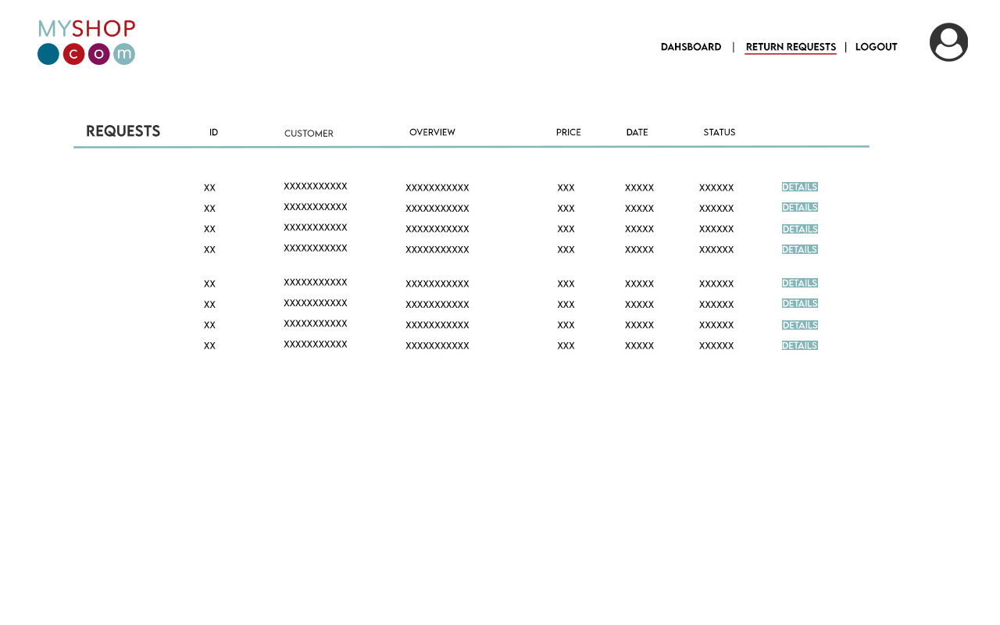

Wireframe 19: collected requests page for a collector.

Wireframe 19 shows the full list of RMAs that must be processed by the Collectors. This page has the ID number for the RMA, the Customer name, an overview which will have a quick look at how many products are in the RMA, the price of the order, the date of the return, the status of the RMA and then a details button beside every RMA which will hold all of the Information on the goods within the RMA and the reason for the RMA. (U22)

**  
**

### 6.6.5 CONTROLLER POV:

**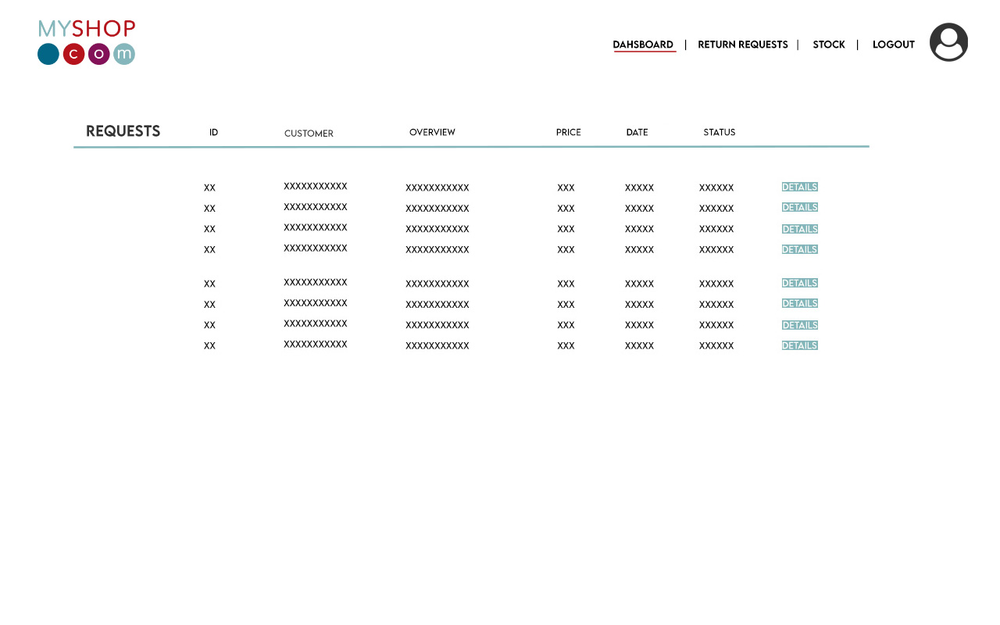**

Wireframe 20: collected requests page for a controller.

Wireframe 20 shows the full list of RMAs that must be assigned to the Controllers. This page has the ID number for the RMA, the Customer name, an overview which will have a quick look at how many products are in the RMA, the price of the order, the date of the return, the status of the RMA and then a details button beside every RMA which will hold all of the Information on the goods within the RMA and the reason for the RMA. (U21)

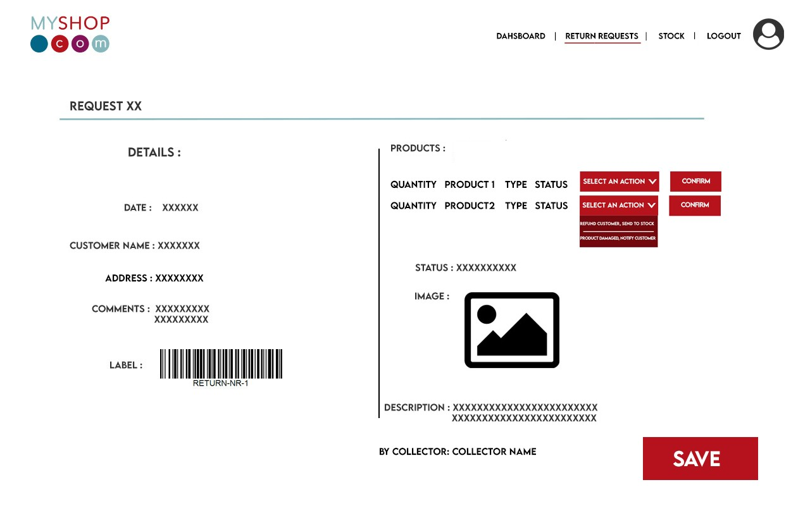

Wireframe 21: request process page for the controller

Wireframe 21 shows the request process page after selecting one of the RMA’s, on this page, you can select an action for the RMA based on the information given previously on the Collectors, the controller can either choose to refund the customer and send it to the stock or the controller can say that the goods are damaged and notify the customer. After selecting your action, the controller can then press the confirm button to finalise the RMA’s process. (U11)

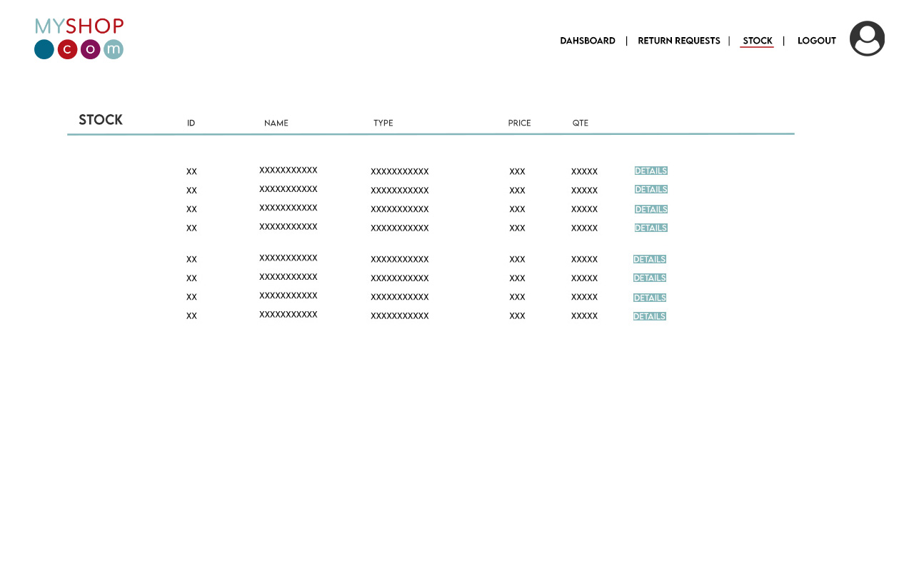

Wireframe 22: stock page for the controller

Wireframe 22 shows the stock page for the company. On this page the controller updates the stock of items based on what has been returned, the items all have an ID, a name, a type (e.g.: food, video game), a price, and the current quantity, the controller can then press the Details button to be able to update the stock. (U12, U20)

# 7.0 Plan of approach:

**Development Plan and Milestones**

## 7.1 Sprint 1: Basic Functionality and Setup

Goal: Establish the foundational environment and basic front-end functionality for one user type (collector/controller) and customer.

Key Tasks:

Set up the development environment.

Develop API calls for the backend database.

Begin frontend development for collector/controller and customer modules.

Establish basic testing protocols.

Milestone: Functional prototype with basic user interactions and data fetching from the database.

### 

## 7.2 Sprint 2: Advanced Development and Feature Integration

Goal: Expand upon the initial functionalities to build a more complete version of the RMA application.

Key Tasks:

Develop and integrate additional requirements and features for various user roles.

Enhance frontend and backend connectivity.

Implement more comprehensive testing and debugging.

Milestone: Advanced version of the RMA application with integrated features for all user roles.

## 7.3 Sprint 3: Refinement and Finalization

Goal: Perfect the application by fixing issues, implementing extra features, and finalizing the project.

Key Tasks:

Address any remaining bugs or issues.

Add final touches and additional requested features.

Conduct thorough testing and quality assurance.

Prepare for project presentation and delivery.

Milestone: Completed, polished, and fully functional RMA application ready for deployment.

## **7.4 Results (Deliverables)**

RMA Application: A web-based responsive application easing product returns.

Documentation: Detailed design documents, user stories, wireframes, functional and non-functional requirements.

Testing Environment: A mock-up test environment for order management.

## **7.5 Organization**

Team Structure: Collaborative approach with clearly defined roles and responsibilities.

Meetings:

Class stand-ups every Tuesday and Thursday for progress sharing and problem-solving.

Weekend collaboration sessions via Discord for review and planning.

Communication:

Regular updates through WhatsApp or Discord.

Use of GitLab for tracking progress on user stories.

Shared documentation for task and project documentation, scrum process and time management.

## **7.6 Borders and Risks**

Scope:

In-Scope: Development of the RMA application, testing environment, and related documentation.

Out-of-Scope: External system integrations not related to RMA processing.

Group Agreements: Adherence to our code of conduct, regular communication, and collaborative problem-solving.

Risk Management:

Regular review of progress and goals.

Adaptive task management in case of delays or complexities. (breakdown of big into smaller workable pieces).

# Appendices:

## Appendix A: Return requirement:

It is not allowed to return food products and open video games. It is impossible to return a product after 14 days, after this period has passed the process must be done via email manually.

## Appendix B: Notes:

**Q&A with the Client:**

Question A: Do we build the testing environment on our own or will there be a template we will be using?  
Client: Just create a mock-up environment for the customer. Put in some product orders with the right properties, so they can be filtered.

Question B: What properties are needed for the products?  
Client: The name of the product, the price, and the product number, is it food or non-food? Is the game sealed or not? Is the return period of 14 days exceeded? If this is the case the RMA must be done manually.

Question C: It is not clear how the scanning should work.  
Client: You can also use a QR Code, that is easier. There should be a wizard for the product to answer the question of why the products are returned. This can be entered on the label which can be generated as PDF with the QR Code. Or enter a number instead of scanning it shows to the controller what is expected to be inside the package.

Question D: What kind of data is stored for the customer?  
Client: Because it is a mock-up it is fine when there will be only a name and an e-mail.

Question E: Is the admin a supervisor and how Account is maintained?  
Client: Since it is a mock-up, the admin creates all the users, and the customer is used as a test user for this prototype.

Question F: When we are creating the prototype, do we have to keep policies in mind?  
Client: We should be able to add information.

Question G: How are the refunds handled?   
Client: If the product is refundable, it goes back into the stock. Before that, it must be checked if the product is refundable.

Question H: How should the refund be done?  
Client: By E-Mail is enough, you do not have to do a real refund with payment. Different Bank Accounts for refunds should be possible. When something is returned from a customer, he should not be able to return it.

Question I: What are all the goods?  
Client: It should be possible to add a condition for a product. The product can be categorised and if it is food, it cannot be returned.

Question J: Is there a constraint in the package?  
Client: Weight and Size of the package can be one. So, it should not be possible to return packages that have a weight of 20kg+ for example.

Question K: Should there be specific cases?  
Client: Yes, for example, if a game is broken before opening the seal there should also be a manual case.

Question L: How does the admin influence the returns?  
Client: As the admin, I want to see if a damaged product was returned that was mentioned as being okay and I also want to see which customer returned it and how much each customer returns.

Question M: Can the admin overwrite the controller’s decision, for example?  
Client: That could be possible, but for now a supervisor mode will be enough.

Question N: Is the product a web app or can it also be accessible through the browser on the phone?  
Client: You should be able to use it on a mobile device. You can also create a real app.

Question O: Can the customer cancel a return?  
Client: As soon as the label is printed it can be tracked with an API and if it is received it cannot be cancelled anymore. Because it is a prototype it is hard to implement, because we receive no feedback from the carrier.

Question P: Should we be able to send a notification of the stock?  
Client: The stock should be automatic and handled by a database.,

Question Q: Localhost or Website?  
Client: For now, localhost, but later it will be on a virtual machine.

Appendix C: Change Log   
We have modified/added the following requirements to accommodate the client’s feedback. We highlighted them in yellow, so it is easier for you to see the changes, here are their numbers:  
U11, U23, U25, U26, U27, F12, F13, F17, F22, F23, F24, F25, F26, F27, F28.

Wireframe 2 changed, according to the client's feedback, and some graphs were added to the admin’s dashboard.

Wireframe 10 is improved, Now the customer can select which items he should return and the quantity.

Wireframe 11 has changed, and now the label has also the address of the reseller.

Wireframe 17 is improved, now the collector can set a status per item and not per RMA, and also now the collector cannot see the name of the returner.

Wireframe 21 is improved based on the client’s feedback, now the controller can decide which individual products will be refunded and returned to stock and which not, the controller was just able to decide for the whole RMA.
