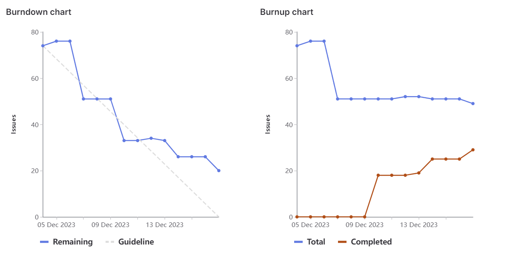
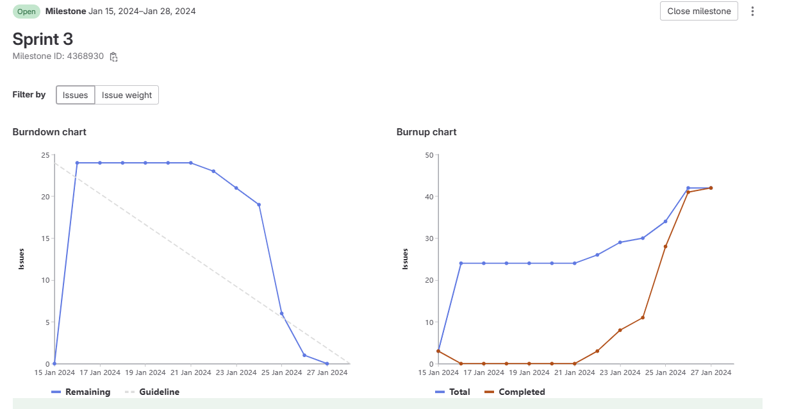

# SPRINT NOTES

## Sprint 0
### sprint 0 standUp 1 (2023-11-21)

We as a team got familiar with the project, read the assignment description, asked for teacher explanation for the unclear aspects of the projects, started planning the questions 
for the client's interview and assigned the team roles (scrum master - note taker) for all the sprints  

### sprint 0 standUp 2 (2023-11-23)

In this standUp, that took place after interviewing the client, we went over the notes taken by Frankie and based on them, we assigned tasks to each team member as follows: 
* Badr: got assigned to make the initial wireframes.
* Georgi: plan of approach, code of conduct, non-functional requirement.
* Frankie: problem overview and solution overview.
* Pablo: business requirements, team introduction, project introduction. 
* Desmond: requirements.
* Brice: user, functional and part of non-functional requirements.
* Marcelo : notes (Appendix B in Functional requirement)

### sprint 0 standUp 3 (2023-11-25)

During this standUp, we went over the assigned tasks to check what had been completed and what hadn't and the encountered issues.
This is what each member had completed by this standUp : 
* Badr: finished the initial wireframes. 
* Georgi: finished plan of approach, code of conduct, non-functional requirement and took over the system and user requirements as they were insufficient.
* Frankie: finished the problem overview and the solution overview from the Functional Design document.
* Pablo: finished the business requirements, team introduction and project introduction from the Functional Design document.
* Desmond: Got urgent family issue and was unable to attend and finish a task, his task was distributed throughout the team. (He flew home for a week, notified team and teacher.)
* Brice: worked on user requirements. They weren't meeting our quality criteria after team check. (Georgi refactored, check georgi's notes)
* Marcelo: He didn't finish task notes (Appendix B in Functional requirement) on time. Therefore, he got remarks from team members to keep up with the deadlines.

And those new tasks got assigned to some members who have already done with their current tasks to take over the missing elements of the FD.

### sprint 0 standUp 4 (2023-11-28)
During this standUp, we checked who had done what, and here are the results : 
* Badr: finish the additional wireframes and UI, and put description for all of them. 
* Georgi: refracted user and functional requirements. Create a use case diagram. create the design considerations part of the system design.
* Desmond: Got urgent family issue and was unable to attend and finish a task, his task was distributed throughout the team. (He flew home for a week, notified team and teacher.)
* Marcelo: finished the task (Appendix B in FD - clients notes) after deadline. Therefore, he got remarks from team members to keep up with the deadlines.

And those are the new assigned tasks : 

* Badr: Navigational diagram together with Georgi. Align wireframes with requirements and user stories. Check requirements with Georgi.
* Georgi: Navigational diagram with Badr, database design with Pablo, database schema and security diagrams.
* Frankie: Software architecture and diagrams (system design).
* Pablo: database design with Georgi. 
* Desmond: Got urgent family issue and was unable to attend and finish a task, his task was distributed throughout the team. (He flew home for a week, notified team and teacher.)
* Brice: User stories.
* Marcelo: Security architecture from System design documentation.

### sprint 0 standUp 5 (2023-11-30)
During this standUp, we checked who had done what, and here are the results :

* Badr: finished navigational diagram together with Georgi. Align wireframes with requirements and user stories. Check requirements with Georgi.
* Georgi: finished navigational diagram with Badr, database design with Pablo, database schema and security diagrams.
* Frankie: finished Software architecture and diagrams (system design).
* Pablo: finished database design with Georgi.
* Desmond: Got urgent family issue and was unable to attend and finish a task, his task was distributed throughout the team. (He flew home for a week, notified team and teacher.)
* Brice: progressed with user stories, but not finished.
* Marcelo: Again, he did not meet the deadlines. his task (Security architecture from System design documentation) was not finished. Thus, a conversation with the teacher took place.

### sprint 0 meeting instead of standUp 6 (2023-12-02)
During this meeting, we had a group discussion to address the internal issues such as communication and commitments from a particular team member. 
A warning was given to Marcelo to get more involved into the project and stick with the deadlines. 

Afterward, we did the scrum poker planning to evaluate the weight of each task, and then we stared to fill in the issues into GitLab's backlog. We did not manage to finalize all 
the issues into GitLab, so we gave each member to convert three user stories to issues(tasks) by the following day.

### sprint 0  standUp 7(2023-12-03)
During this standUp, we checked who had done what, and here are the results:
* Badr: finished Api-Specification and Gitlab issues. 
* Georgi: refactored the whole FD and SD, so that it will be ready to submit on BB and finished Gitlab issues.
* Desmond: Got urgent family issue and was unable to attend and finish a task, his task was distributed throughout the team. (He flew home for a week, notified team and teacher.)
* Brice: Finalised the user stories and Gitlab issues.
* Marcelo: finished his task (Security architecture from System design documentation) after deadline and finished Gitlab issues. 
* Pablo: finished Gitlab issues
* Frankie: finished Gitlab issues

## Sprint 1
### sprint 1 standUp 1 (2023-12-05)
On Monday (2023-12-04), we received the client's feedback of what we had delivered last week, he wanted us to refactor FD, add some details and send him our SD.
We assigned the following tasks and started working on them in class: 
* Marcelo: he started working on the user interface
* Brice: implemented the user, product and order controller.
* Badr: started creating new wireframes based on client's feedback + and started refactoring navigational diagram.
* Pablo & Georgi: started correcting requirements based on feedback from the client.
* Desmond: he started working on the performance part of the system design.
* Frankie: software architecture
* Georgi: Assigned to create Intellij project structure (server and client side)

### sprint 1 standUp 2 (2023-12-07)
On this standUp, we finally completed all the tasks by all the members. The client was emailed with the updated version of the FD and SD.

### sprint 1 standUp 3 (2023-12-10)
During this standUp, we checked who had done what, and here are the results:
* Marcelo: he didn't attend the stand-up for emergency reason. he didn't prove that his tasks have been completed.
* Badr: Finished his task
* Pablo: Finished his task
* Desmond: Finished his task
* Frankie: Finished his task
* Georgi: Finished his task
* Brice: Finished his task

### sprint 1 standUp 4 (2023-12-12)
* Marcelo: he left the course for personal reasons.
* Badr: working on fetches for admin and login (frontend side)
* Pablo: working on database
* Desmond: working on fetches for client
* Frankie: working on controller dashboard
* Georgi: working on his task "admin components partially finished"
* Brice: finish all the api spec for orders and users. RMA needs to be done after pablo done with DB

### sprint 1 standUp 5 (2023-12-13)
* Badr: finished fetches for Admin
* Pablo: changed database design, and table (done)
* Desmond: queries and tested backend (task done) 
* Frankie: working on controller dashboard
* Georgi: finished his admin components task
* Brice: finalize the fetches and backend testing

### sprint 1 standUp 6 (2023-12-17)
* Badr: after presentation, went through code for refactoring 
* Pablo: worked on CoC
* Desmond: worked on system design
* Frankie: went through the controller pages and connected them
* Georgi: worked on sequence diagrams for the system design, implemented return constraints on the client side,worked on refactoring the code 
* Brice: went through the documentation for refactoring and update the logical view (requirements).

these are the results of this sprint, all the objectives that were planned are done. and here is the burnout chart : 

## Sprint 2 (18/12/23 - 14/01/24)
Scrum Master - Georgi
Note Taker - Desmond

### Sprint 2 StandUp 1 (19/12/23)
* Badr - Role dropdown is created, but not complete and tested bcz there is no endpoint for that
* Brice - Added missing notes what brice did and when through the documentation for refactoring.
* Desmond - Updated the system design
* Frankie - Updated the POA
* Georgi - Created the return constraints on the client side so that an item (food, non-sealed video game, order after 14 days) cannot be returned.
* Pablo - Updated the COC document

### Sprint 2 StandUp 2 (21/12/23)
* Badr - Created the drop-down in the creation user admin page
* Brice -  Implementation of the controller RMA.
* Desmond - Updated the functional design
* Frankie - Connected the controller to the backend
* Georgi - Refactored Sprint Notes
* Pablo - Updated the Database design and implemented the new tables/queries

### Sprint 2 StandUp 3 (23/12/23)
* Badr - Connecting the frontend and backend of the admin
* Brice - Create the backend logic to store the image location in the database
* Desmond - Connecting the backend and frontend of the client
* Frankie - Work on the RMA router and controller
* Georgi - Researched API for email service for user to reset password
* Pablo - Connecting the backend and frontend of the collector

### Sprint 2 StandUp 4 (09/01/24)
* Badr - Continued connecting the frontend and backend of the admin
* Brice - Developed the image upload for the controller
* Desmond - Continued connecting the backend and frontend of the client
* Frankie - Connecting the backend and frontend fof the controller
* Georgi - Implemented the reset password function by sending an actual email to the client using external api
* Pablo - Continued Connecting the backend and frontend of the collector

### Sprint 2 StandUp 5 (11/01/24)
* Badr - Developed the admin graphs further and added some data points such as numbr of users
* Brice - Developed the barcode scanner
* Desmond - Developed the client further - request rmas
* Frankie - Developed the controller further, fixed the header issue depending on role
* Georgi - Developed the collector further - page after scanning the barcode
* Pablo - Developed the collector further - testing

## Sprint 3 (15/01/24 - 28/01/24)
Scrum Master - Badr
Note Taker - Georgi

### Sprint 3 StandUp 1 (16/01/24)
* georgi - tried to fix issues in the working on making the components responsive
* pablo - worked on client returns - see details (image, quantity, price, date description, status)
* desmond - working on a rma creation form
* brice - testing the barcode and scan barcode, has a problem and asks help to desmond
* badr-trying to retrieve details for users and rma (for admin), has issue switching pages
 
* The following tasks were assigned for next stand-up:

* georgi and badr - work and finalize functionalities for admin
* pablo - work on the page of the return request details of the client
* desmond and brice - work on collector functionalities for scanning a barcode and generating a barcode for the client
* frankie - assigned to work controller functionalities

### Sprint 3 StandUp 2 (18/01/24)
* georgi - fixed the graph for weekly/monthly/yearly RMAs to display, made the deletion of a user, creation of a user, assignment of a role to a user and the displaying of details of a user work
* badr- still working on making the RMA graph display statistics, he is facing issues from the backend
* pablo- made a page so that the client can see the details of the return request he makes, he can see the status, image, price etc.
* brice and desmond - working on the barcode creation and working on the page for the printing label.

Assigned tasks:
* badr - finish the admin statistics page
* georgi - implement the functionality to lock an RMA for one controller so no other controllers can interfere.
* brice and desmond - finish their previously assigned tasks
* frankie - finalize the controller's dashboard.

### Sprint 3 StandUp 3 (21/01/24)
* frankie - finished all functionality of the controller
* desmond - fixed "my orders" of the customer and worked on improving the database queries
* Badr - finished line chart for analytics on the Admin dashboard, implemented the functionality of the admin to overrule the controller.
* pablo - faces problem on the client side of the Client dashboard of returned requests will ask for help from our teacher Eelco Jannink.
* georgi - made the lock functionality for Controller so that only one controller can process an RMA at a time.

Assigned tasks:
* desmond - work on fixing issues in Customer dashboard, add more intuitive steps and instructions on how to return a product.
* brice - make HTTP tests
* pablo - resolve issues he is facing with his task and finalizes it
* frankie - add credit line to controller dashboard, add alerts for important actions, show the amount that will be refunded when pressed on the refund button
* georgi - implement all functionalities of collector (qr code scanning, navigate to RMA page after qr scanning, dealing with products within an RMA individually, 
locking already processed products within an RMA, implement functionality to upload an image as a collector, make the entire collector fully responsive)

### Sprint 3 StandUp 4 (23/01/24)
* frankie - completed his assigned task
* desmond - completed his assigned task
* pablo - completed his assigned task
* georgi - completed his assigned tasks
* brice - completed his assigned tasks

New tasks that were assigned
* desmond - implement image uploading functionality for customers
* brice - add more HTTP tests
* pablo - make a progress bar for a more intuitive return process for customers, prepare test scenario documentation to provide the client to test the application with in the final demo
* frankie - display the images and comments per product within an RMA (images and comments placed by customer and collector)
* georgi - improve the entire styling of the website,
  display the image and description placed by a customer per product within an RMA, add a toggle that displays 
instructions on how to process and rma as a collector, fix the issue of displaying the description wrong in the customer dashboard.
* badr - fix the pie chart in the admin dashboard, improve the styling of the camera instance of the qr scanner, prepare the final presentation of sprint 3

### Sprint 3 StandUp 5 (25/01/24)
* Tasks were completed.

In sprint 3 we overachieved and had our most successful sprint of all 3, we impressed ourselves and also the client of what we are capable achieving in less than 2 weeks. Here is the burn down chart of sprint 3:

